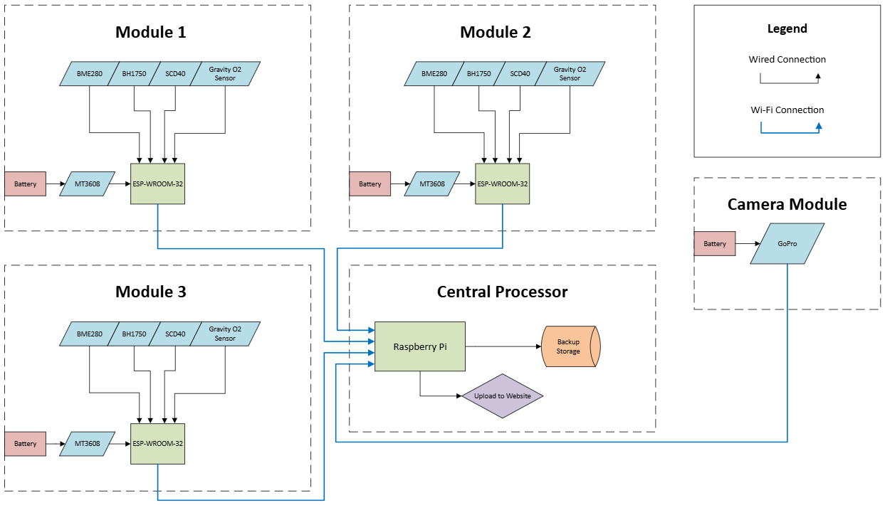
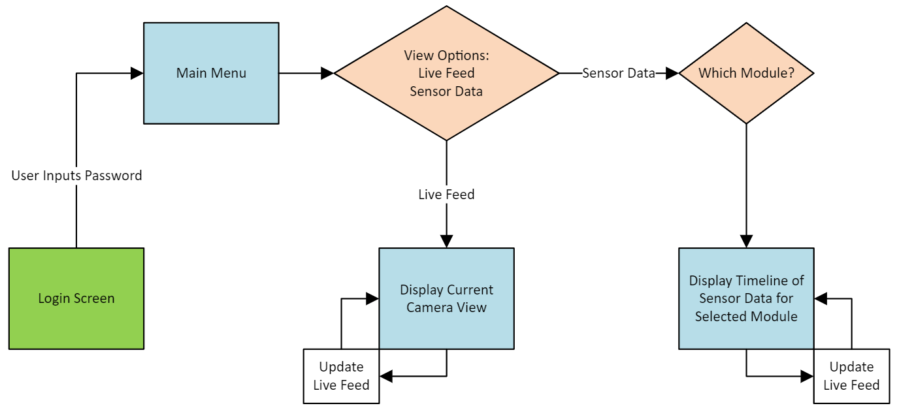
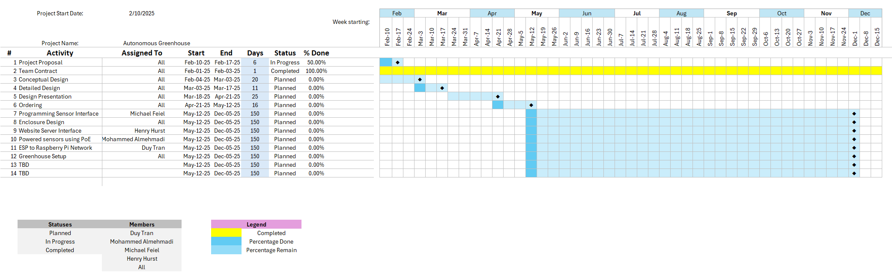

# Conceptual Design
## Introduction
In today’s rapidly advancing technological landscape, the demand for portable, efficient, and data-driven systems is more prevalent than ever. The proposed project aims to develop a robust, modular solution designed to collect, process, and transmit data wirelessly, all while maintaining portability and operational reliability. The system’s primary objective is to seamlessly integrate hardware and software components into a cohesive framework capable of continuous data monitoring and real-time reporting.

To meet stakeholder expectations and align with industry standards, the system will incorporate modular hardware units powered by battery sources, minimizing cable dependency and enhancing mobility. These modules will transmit data wirelessly to a central processor, which will then update a cloud-based platform when a stable Wi-Fi connection is available. Additionally, the system will feature local data storage to ensure no loss of information during network outages, thereby maintaining data integrity and availability.

The conceptual design process will focus on defining clear requirements, decomposing the system into atomic subsystems, and addressing all relevant constraints. Through comparative analysis, potential solutions will be evaluated to determine the most viable approach, with an emphasis on efficiency, scalability, and user accessibility. This document provides the project’s high-level solution, including hardware architecture, operational flow, and subsystem specifications, while also addressing ethical, professional, and regulatory considerations.
## Fully Formulated Problem
The primary objective of this project is to develop a portable, modular data collection and transmission system that operates reliably in various environments. The system shall consist of lightweight, battery-powered modules capable of gathering data and wirelessly transmitting it to a central processing unit. The central processing unit shall manage data aggregation and update a cloud-based platform in real-time when a stable Wi-Fi connection is available. In the event of network unavailability, the system shall store collected data locally to ensure data preservation and continuity.
### Portable Sensor Network Specifications: 
1. Portability and Compactness: Modules shall be lightweight and compact to facilitate mobility and ease of deployment.
   - Sensor Units: Modules shall monitor and record temperature, humidity, light intensity, CO₂, and oxygen levels across multiple locations.
   - Unit Chassis: The unit housing shall withstand greenhouse environmental conditions, including high humidity and dust.
2. Battery Operation: Modules shall be battery-powered to eliminate dependency on fixed power sources.
   - Battery Lifespan: Batteries shall be able to operate for minimum of 72 hours before recharging.
   - Battery Safety Standard: The system shall not exceed 50V operating voltage to comply with OSHA regulations.
   - Power Converter and Electrical Components: The power converter and electrical components shall be designed for safe operation in greenhouse conditions to prevent electrical hazards	
3. Power Monitoring: Each module shall track its battery level and alert users when recharging or replacement is necessary.
4. Wireless Data Transmission: Collected data shall be transmitted wirelessly from each module to the central processor for real-time monitoring.
5. Cloud Integration: The central processor shall transmit data to a cloud platform when Wi-Fi connectivity is available.
6. Offline Data Storage: In the absence of network connectivity, modules shall store data locally to ensure no data loss for offloading.
7. Data Visualization and Retention: The cloud platform shall display live data and retain historical data for analysis and monitoring.
   - Website Interface: The graphic user interface shall provide a web-based dashboard for data visualization and remote access.
8. Camera: The central processing unit shall integrate a camera system for plant growth tracking.

These requirements have been established in collaboration with stakeholders to address functional needs while complying with industry standards and best practices. The design will also account for ethical, safety, and environmental considerations to minimize risks and enhance system sustainability.

### Constraints:
- Environmental Conditions (IP67): To ensure reliability in high-humidity, dust-prone environments (IEC 60529 Standard).
  - IP65 or higher for protection against dust and low-pressure water jets.
  - IP67 if additional submersion resistance is required.
  - The enclosures shall comply with NEMA 4X as an alternative to IP ratings, providing dust-tight, watertight, and corrosion-resistant enclosures.
  - The materials used in enclosures and components shall comply with ASTM B117 for salt fog resistance in corrosion-prone areas.
- Power Limitations (50V max): To comply with OSHA regulations for electrical safety (29 CFR 1910.303, 29 CFR 1910.307).
  - 29 CFR 1910.303 for general electrical safety compliance
  - 29 CFR 1910.307 for electrical safety in wet/damp locations.
  - 50V or lower DC systems classified as "low voltage" per OSHA standards.
- Safety and Regulatory Compliance (NEC, UL): To prevent electrical hazards and ensure safe operation (NEC Article 547, NEC 210.8(B), NEC 250.32, UL 943, UL 1449).
- Sensor and Actuator Integration: To ensure accurate responses based on environmental data.
## Comparative Analysis of Potential Solutions
Greenhouse monitoring systems are essential for maintaining optimal growing conditions and maximizing crop yield. Currently available solutions range from DIY approaches to industrial-grade systems, each with its own advantages and disadvantages. Below, we analyze multiple existing solutions to determine their suitability for solving the problem at hand.

#### DIY Solutions
DIY greenhouse monitoring systems are commonly showcased in online tutorials and videos, providing basic environmental monitoring at a low cost. These systems typically involve using off-the-shelf components such as Arduino or Raspberry Pi boards combined with sensors for temperature, humidity, and soil moisture.

Advantages:
- Low Cost: Affordable components make these systems budget friendly.
- Customizability: Flexible design options allow for adaptation to specific needs.
- Educational Value: Building a DIY system offers valuable hands-on experience.
Disadvantages:
- Lack of Accuracy and Durability: Often built with low-cost sensors, which may degrade over time.
- Limited Data Management: Typically lacks advanced data processing and cloud integration.
- High Maintenance: Requires frequent adjustments and troubleshooting.
________________________________________
Industrial Solutions
Industrial-grade greenhouse monitoring systems are comprehensive and precise, designed for large-scale commercial operations. Some notable solutions include:
1. iGrow 800 Environmental Controller
   - Cost: $4,145.00
   - Pros: Advanced environmental monitoring (temperature, humidity, CO₂).
   - Cons: 
      - High cost makes it impractical for small to mid-sized greenhouses.
      - Does not include oxygen monitoring.
      - Complexity may require specialized training.
2. WIFI Greenhouse Monitoring System from ACF Greenhouses
   - Cost: $69.00
   - Pros: Affordable and easy to set up.
   - Cons: 
      - Limited functionality, lacking advanced features like oxygen monitoring and light intensity sensors.
      - Inconsistent data coverage due to WiFi dependency.
      - No offline portability.
3. Sensaphone 1800 Monitoring System
   - Cost: $1,014.95
   - Pros: Can monitor up to 8 environmental conditions.
   - Cons: 
      - High upfront cost.
      - Primarily monitoring-focused without automation capabilities.
      - Requires telephone lines, reducing portability.
4. ECLIPSE F90 Master Environmental Controller
   - Cost: Varies
   - Pros: Precise control of temperature, humidity, and CO₂ levels.
   - Cons: 
      - Complex setup requiring technical knowledge.
      - Lacks oxygen and light intensity monitoring.
      - No offline data portability.
5. Monnit Wireless Sensor Systems
   - Cost: Varies based on configuration
   - Pros: Comprehensive wireless monitoring for multiple environmental factors.
   - Cons: 
      - Potentially expensive with multiple sensors.
      - Wireless connectivity may be unreliable in dense greenhouse setups.
      - Lacks offline data collection and oxygen monitoring.
6. Ceres SunSense™ Controller
   - Cost: Custom pricing
   - Pros: Advanced monitoring with temperature, humidity, CO₂, and PAR tracking.
   - Cons: 
      - High cost and steep learning curve.
      - No oxygen monitoring or offline data offloading.
7. EDYCARX CO₂ Controller
   - Cost: Approximately $300
   - Pros: Effective CO₂, temperature, and humidity monitoring.
   - Cons: 
      - Focused on CO₂ regulation, requiring additional systems for complete monitoring.
      - Lacks light intensity and oxygen concentration monitoring.
8. INKBIRD CO₂ Controllers
   - Cost: $100 to $400
   - Pros: Maintains optimal CO₂ levels for plant growth.
   - Cons: 
      - Limited scope, primarily CO₂ monitoring.
      - No comprehensive environmental control or offline data capability.
9. Sensaphone 400 Monitoring System
   - Cost: $455.00
   - Pros: Monitors four environmental conditions efficiently.
   - Cons: 
      - Limited monitoring points (only 4), unsuitable for larger greenhouses.
      - No light intensity or oxygen monitoring.
      - Lacks offline data portability.
#### Analysis and Selection

Existing solutions either lack modularity and scalability or come at a prohibitive cost for small to medium-sized greenhouse operations. Additionally, many systems do not offer oxygen monitoring, light intensity tracking, or offline data management, which are crucial for reliable and adaptable greenhouse management.

After evaluating the advantages and disadvantages of current systems, it is clear that a new solution must address the following gaps:
1. Affordability and Scalability: Suitable for small to mid-sized operations.
2. Modular and Customizable Design: Allowing users to tailor the system to their specific needs.
3. Comprehensive Environmental Monitoring: Including temperature, humidity, CO₂, oxygen, and light intensity.
4. Offline Data Portability: Ensuring data collection even when Wi-Fi connectivity is lost.
5. Ease of Use and Maintenance: Minimal technical expertise required for installation and operation.

By incorporating these features into a single hybrid solution, the proposed system aims to bridge the gap between DIY and industrial solutions, providing a cost-effective, modular, and robust monitoring system that meets the needs of diverse greenhouse applications.

## High-Level Solution
The proposed portable sensory network will use three remote units using the ESP32 microcontrollers and a raspberry pi as a central control unit. The remote units will each aggregate data via the five sensors (CO2, oxygen, humidity, light intensity, and temperature). After the data has been recorded, it will be sent to the central processing unit (raspberry pi) for cloud uploading and data storage through the MQTT protocol. Each of the individual units will be powered by batteries through a boost-converter to reach a consistent 3.3 volts.  As for the power of the central processing unit, it will be powered by the provided 5-volt power supply. After the data has been recorded and sent to the central processing unit, the data will be uploaded to a cloud for interfacing through a website. The website will give a dashboard view of each of the individual remote units and their respective sensor readings. 

### Hardware Block Diagram

 

### Operational Flowchart

 

#### Key Features
1. Modularity and Scalability:
   - The system will support the addition of new sensors without requiring significant reconfiguration.
   - The modular design will allow users to tailor the system to their specific needs, whether for small-scale or commercial applications.
2. Wireless Data Transmission and Local Storage:
   - Sensor data will be transmitted via Wi-Fi or MQTT protocols to a central Raspberry Pi unit.
   - In the event of a connectivity failure, data will be stored locally on the Raspberry Pi and uploaded once the connection is restored.
   - The system will support offline data portability through USB or SD card transfer.
3. Data Integrity and Reliability:
   - Data consistency checks will ensure that sensor readings remain within expected ranges, detecting any anomalies or sensor drift.
   - Regular calibration routines will maintain accuracy, comparing sensor outputs to known standards.
   - Redundant sensors will be deployed in critical areas to cross-verify measurements.
4. User-Friendly Interface and Real-Time Monitoring:
   - A web-based dashboard will display real-time data and historical trends.
   - Customizable alerts will notify users of environmental anomalies via email or mobile notifications.
   - User access levels will be configurable, allowing administrators to grant or restrict access to specific features.
5. Power Efficiency and Durability:
   - Low-power components and sleep mode functionality will optimize battery life.
   - Rugged enclosures will protect sensors from moisture, dust, and temperature extremes, maintaining reliability in greenhouse environments.
6. Seamless Data Management and Analytics:
   - Data will be logged and timestamped to allow trend analysis and prediction.
   - The system will provide downloadable CSV files for integration with third-party analytics software.
________________________________________

#### Evaluation and Success Criteria
To ensure the system's effectiveness and reliability, the following key performance indicators (KPIs) and testing methodologies will be employed:
1. Accuracy and Reliability:
   - Calibration testing will compare sensor readings against reference devices.
   - Environmental stress testing will assess stability and accuracy under varying conditions.
   - Success Metric: Sensor deviation of less than ±2% from reference standards.
2. Data Transmission and Integrity:
   - Wireless range tests will evaluate the distance and stability of data transmission.
   - Offline data storage tests will verify uninterrupted logging during connectivity loss.
   - Success Metric: 100% data retention and less than 1-second latency during transmission.
3. Power Efficiency:
   - Discharge tests will determine battery life under normal operation.
   - Power profiling will identify any components with high energy consumption.
   - Success Metric: Minimum of 12 hours of battery life under continuous operation.
4. System Durability:
   - Moisture and temperature endurance tests will simulate real-world conditions.
   - Drop tests will verify enclosure durability and component security.
   - Success Metric: No loss of functionality after 24-hour exposure to high humidity and temperature extremes.
5. User Experience:
   - User testing will gather feedback on setup, usability, and data interpretation.
   - Interface testing will ensure real-time data visualization and intuitive controls.
   - Success Metric: Positive user feedback on ease of use and data clarity.
6. Cost-Effectiveness and Scalability:
   - Comparative cost analysis will benchmark the solution against commercial systems.
   - Modular expansion tests will verify that additional sensors do not degrade performance.
   - Success Metric: System cost 50-70% lower than comparable industrial solutions.
________________________________________

By implementing this high-level solution, the system will effectively bridge the gap between expensive industrial monitoring solutions and affordable DIY alternatives, delivering reliable and scalable environmental monitoring for a wide range of greenhouse applications. 

## Atomic Subsystem Specifications
- Sensor Node (ESP32): 
  - Functions: Data acquisition, wireless transmission, local storage.
  - Inputs: Sensor data, battery voltage.
  - Outputs: Wireless data (MQTT).
  - Interfaces: Sensor data (digital, analog), battery power, Wi-Fi.
  - “Shall” measure temperature, humidity, light, CO2, and O2. “Shall” transmit data every 5 minutes when Wi-Fi is available. “Shall” store data hourly when Wi-Fi is unavailable.
- Raspberry Pi 4: 
  - Functions: Data processing, storage, web interface.
  - Inputs: Wireless data (MQTT), camera feed.
  - Outputs: Web dashboard, data offloading.
  - Interfaces: Wi-Fi, USB, camera module.
  - “Shall” store sensor data in a database. “Shall” host a web server for data visualization. “Shall” allow data offloading via USB.
- Web Dashboard: 
  - Functions: Data visualization, user interface.
  - Inputs: Database data, camera feed.
  - Outputs: User interface.
  - Interfaces: Web browser.
  - “Shall” display real time and historical data. “Shall” provide user authentication. “Shall” display camera feed.
- Camera System: 
  - Functions: image capture, image storage.
  - Inputs: Raspberry Pi trigger.
  - Outputs: Image files.
  - Interfaces: Raspberry Pi camera port.
  - “Shall” take a photo every hour. “Shall” store photos on the Raspberry Pi.
## Ethical, Professional, and Standards Considerations
- Environmental Impact: The system promotes efficient resource management in greenhouses, reducing waste. This has implications for local food security, reducing dependency on imports and strengthening regional food systems.  
- Long-Term Cost Considerations: While the system may increase initial power usage, optimizing energy efficiency and automating data collection could lead to long-term savings by improving resource management and reducing manual labor.
- Safety: Adherence to electrical safety standards (OSHA, NEC, UL) ensures safe operation. Such risks involve electricity, structure, and gases.
- Data Privacy: User authentication and access control protect sensitive data.
- Standards: Compliance with IEC 60529, NEC, UL standards for environmental protection and electrical safety.
  - 29 CFR 1910.303 for general electrical safety compliance.
  - 29 CFR 1910.307 for electrical safety in wet/damp locations.
  - 50V or lower DC systems classified as "low voltage" per OSHA standards.
  - NEC Article 547, which covers electrical safety requirements for agricultural buildings, including greenhouses.
  - NEC 250.32, which specifies grounding requirements for separate structures.
  - NEC 210.8(B), which mandates GFCI protection for 15A & 20A, 120V outlets in damp/wet.
  - UL 943 for GFCI safety compliance.
  - UL 1449 for surge protection device compliance.
## Resources
- Budget:
- The estimated budget for the project is outlined below:

| Item | Description | Quantity | Cost |
|------|-------------|----------|------|
| Raspberry Pi | Central Microcontroller | 1 | $35 |
| ESP-WROOM-32 | Sensors Microcontroller | 3 | $12 per 4|
| Eneloop Pro | Batteries | 16 | $36.45 per 8 |
| BME280 | Humidity Sensor | 3 | $15.99 per 2 |
| BH1750 | Light Measurement | 3 | $7.49 per 3 |
| MG811 | CO₂ Monitoring | 3 | $49.90 |
| MT3608 | Boost Converter | 3 | $5.99 per 5 |
| AlphaSense O2-A3 Oxygen Sensor | Oxygen Sensor | 3 | $82 |
| 3D Printing Plastic Filaments | Used for Case Prototype | 3 | $12.99 |
| DS18B20 | Temperature Sensor | 3 | $9.95 |
| Go Pro | Visual Feed | 1 | $20.00 |

  - Sensor Nodes: $400 (sensors, ESP32, enclosures, batteries).
  - Raspberry Pi 4: $100 (Pi, camera, power supply).
  - Total: $500.
- Division of Labor: 
  - Duy Tran: Sensor Node Design, Sensor Integration.
  - Michael Feiel: Raspberry Pi Integration, Software Development.
  - Henry Hurst: Web Dashboard, Camera System.
  - Mohammed Almehmadi: Enclosure Design, Power Management.
- Timeline: 

 
 

References
- [1] DATASHEET raspberry pi 4 model B. (n.d.). https://datasheets.raspberrypi.com/rpi4/raspberry-pi-4-datasheet.pdf 
- [2] Adafruit. (n.d.-a). https://cdn-learn.adafruit.com/assets/assets/000/115/588/original/bst-bme280-ds002.pdf?1664822559= 
- [3] Digital 16bit serial output type ambient light sensor IC. (n.d.-c). https://www.mouser.com/datasheet/2/348/bh1750fvi-e-186247.pdf 
- [4] Dfrobot. (n.d.-c). https://image.dfrobot.com/image/data/SEN0159/CO2b%20MG811%20datasheet.pdf 
- [5] Karle, S., Bansode, V., Tambe, P., & Bhambare, R. (n.d.). (PDF) IOT based greenhouse monitoring system using Raspberry Pi. IoT Based Greenhouse Monitoring System Using Raspberry Pi. https://www.researchgate.net/publication/354297402_IoT_Based_Greenhouse_Monitoring_System_Using_Raspberry_Pi
- [6] ChatGPT. (2025). AI-based text refinement for improved structure, readability, and formatting. OpenAI.
- [7] Amazon. (n.d.). Environmental monitoring, light measurement, batteries, and boost converter devices. 
  - -BME280 Sensor: https://www.amazon.com/Atmospheric-Pressure-Temperature-Humidity-GY-BME280/dp/B0DHPCFXCK/
  - - BH1750 Light Sensor: https://www.amazon.com/HiLetgo-BH1750FVI-intensity-illumination-arduino/dp/B00M0F29OS/
  - - Eneloop Pro Batteries: https://www.amazon.com/Panasonic-BK-3HCCA8BA-eneloop-Pre-Charged-Rechargeable/dp/B00MXCIK32/
  - - MT3608 Boost Converter: https://www.amazon.com/AITRIP-Converter-Adjustable-Voltage-Regulator/dp/B0C858YYQ1/
- [8] Elecfreaks. CO2 Monitoring Sensor: https://shop.elecfreaks.com/products/elecfreaks-octopus-co2-gas-sensor-mg811?srsltid=AfmBOoo9ZJgZG6MylX-AZjXNEBDBYNR3Z3_EC5a-3VQngJpJEwLPc0AH
- [9] International Electrotechnical Commission (IEC). (1989). Degrees of Protection Provided by Enclosures (IP Code), IEC 60529. IEC.
- [10] Liu, Y. (n.d.). Smart Greenhouse Monitoring and controlling based on ... Smart Greenhouse Monitoring and Controlling based  on NodeMCU . https://thesai.org/Downloads/Volume13No9/Paper_70-Smart_Greenhouse_Monitoring_and_Controlling.pdf 
- [11] Abdul-Majid, M., Zahari, S. A., Othman, N., & Nadzri, S. (2024). Influence of technology adoption on farmers' well-being: Systematic literature review and bibliometric analysis. Heliyon, 10(2), e24316. https://doi.org/10.1016/j.heliyon.2024.e24316
- [12] IGrow 800 environmental controller. Greenhouse Megastore. (n.d.). https://www.greenhousemegastore.com/collections/environmental-controls/products/igrow-800-environmental-controller?variant=42701245382855 
- [13] WIFI greenhouse monitoring system with temperature & humidity alarms. ACF Greenhouses. (n.d.). https://www.acfgreenhouses.com/wifi-greenhouse-monitoring-system 
- [14] Sensaphone 1800 Monitoring System w/NEMA 4X solid door enclosure FGD-1800-SD. Core & Main. (n.d.). https://supply.coreandmain.com/Sensaphone-1800-Monitoring-System-w-NEMA-4X-Solid-Door-Enclosure-FGD-1800-SD
- [15] Alphasense O2-A3 Oxygen Sensor. Gaslab.com. (n.d.). https://gaslab.com/products/alphasense-02-a3-oxygen-sensor?currency=USD&utm_medium=cpc&utm_source=google&utm_campaign=Google+Shopping&variant=15400019165219 
- [16] Eclipse F90 master environmental controller. Gothic Arch Greenhouses. (n.d.). https://www.gothicarchgreenhouses.com/eclipse-f90-master-environmental-controller 
- [17] Monnit Wireless Sensor Systems. Long-range Wireless Sensors for Remote Monitoring. (n.d.). https://www.monnit.com/products/sensors/ 
- [18] SunSenseTM controller. Ceres Greenhouse. (n.d.). https://ceresgs.com/sunsense-controller/ 
- [19] EDYCARX CO2 Controller with temperature and humidity display day and night with relay function 15ft Ndir Sensor Cable, CO2 Controller for Grow Room, greenhouse, Grow Tent, home, office, factory : Patio, Lawn & Garden. (n.d.-b). https://www.amazon.com/EDYCARX-Dioxide-Controller-Function-Greenhouse/dp/B0BQR8GHR5 
- [20] INKBIRD programmable CO2 Controller W/ S01 sensor ICC-500T. INKBIRD. (n.d.). https://inkbird.com/products/programmable-co-controller-icc-500t 
- [21] Sensaphone 400 & 800 monitoring systems. Sensaphone. (n.d.). https://sensaphone.com/products/sensaphone-400-and-800-monitoring-systems/ 
- [22] Industries, A. (n.d.). Waterproof 1-wire DS18B20 digital temperature sensor. adafruit industries blog RSS. https://www.adafruit.com/product/381?gQT=1

- Sources for Standards:
  - ASTM International.
  - U.S. Department of Defense.
  - International Electrotechnical Commission (IEC) 60529 Standard.
  - National Electrical Manufacturers Association (NEMA) Standards Publication 250.
  - Occupational Safety and Health Administration (OSHA) regulations.
  - European Union Directive 2014/35/EU.
  - National Fire Protection Association (NFPA) 70 – National Electrical Code (NEC).
  - Underwriters Laboratories (UL) Standards.

## Statement of Contributions
- Duy Tran: Sensor Node Design, Power Management, Document Editing.
- Michael Feiel: Web Dashboard, Software Development, Flowchart, Block Diagram.
- Henry Hurst: Raspberry Pi Integration, Camera System.
- Mohammed Almehmadi: Enclosure Design, Sensor Integration, Constraint Research. 
