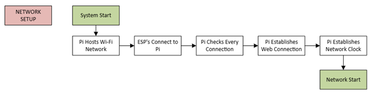
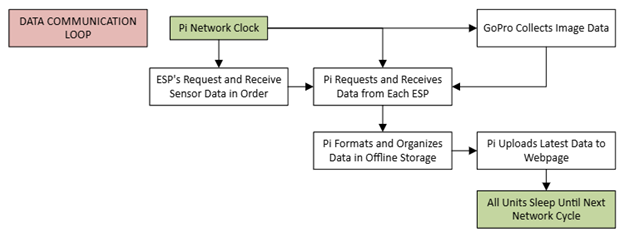

# Data Communication Detailed Design

This document presents a comprehensive overview of the Data Communication subsystem, one of the four key components of the greenhouse monitoring solution—the others being the Power Subsystem, Sensor Subsystem, and Mechanical Subsystem. While the primary focus is on the Data Communication Subsystem, a high-level integration overview with the remaining subsystems is also provided to highlight system interdependencies and ensure cohesive functionality. The document further outlines the technical constraints, relevant industry standards, and operational limitations that influence the design and deployment of the Data Communication Subsystem. Lastly, it details the step-by-step procedure for designing and implementing the subsystem as part of the overall greenhouse monitoring solution.

## Function of the Subsystem

The Data Communication Subsystem plays a crucial role in the greenhouse monitoring system by connecting each sensor module to the central hub—a Raspberry Pi 4—wirelessly. Each module will contain an ESP-WROOM-32 microcontroller that will interface with four sensors that will gather environmental data. Each module will be assembled based on a PCB (printed circuit board).

For communication, each ESP-WROOM-32-based remote sensor unit will utilize Wi-Fi to establish a wireless connection with the central processing hub. To ensure accurate data management, every sensor unit will be assigned a unique device identifier, allowing the central hub to differentiate incoming data streams and avoid any potential overwriting of information. As real-time environmental data is collected from the onboard sensors, it is transmitted to the Raspberry Pi for processing and visualization on the system's website dashboard. In the event of network downtime or offline operation, the Raspberry Pi is equipped with an SD card that serves as a local storage solution, retaining the latest recorded data from each sensor unit to ensure data integrity and continuity.

## Specifications and Constraints

The data communication subsystem shall wirelessly transmit environmental sensor data from each greenhouse monitoring node to a centralized storage system via Wi-Fi. Data shall be logged locally to an SD card for redundancy and also transmitted to a cloud-based server for remote access and long-term archival. A responsive web-based interface shall enable authorized users to visualize real-time and historical data from most modern internet-connected devices. Users shall also be able to export datasets as Excel-compatible files for external analysis.

### Wireless Communication Standards Compliance

The subsystem shall adhere to the IEEE 802.11n standard for wireless local area networking, enabling robust and energy-efficient Wi-Fi connectivity suitable for embedded systems. All communication modules shall support WPA2-PSK encryption or higher to meet current cybersecurity best practices, as outlined in the IEEE 802.11i standard for wireless security. IPv4 addressing shall be used for device identification and data routing within the local network, consistent with RFC 791.

### Local Storage Compliance

Sensor data shall be locally stored on SD cards using the FAT32 file system, as defined by the SD Association and Microsoft FAT specification. This ensures compatibility with common file readers and simplifies data recovery in the event of communication failure. The physical interface shall conform to SD Physical Layer Specification Version 2.00 or later.

### Cloud Storage and Data Transmission Security

All outbound data transmitted to cloud servers shall be encrypted using the Transport Layer Security (TLS) protocol, version 1.2 or higher, consistent with RFC 5246. Data payloads shall be formatted in JavaScript Object Notation (JSON), as defined in ECMA-404, to support interoperability with modern RESTful APIs. Cloud services shall maintain ISO/IEC 27001 compliance to ensure appropriate information security management practices are observed.

### Web Display Accessibility and Compatibility

The web-based data visualization interface shall be implemented using HTML5, CSS3, and JavaScript (ECMAScript 2015 or later) to ensure cross-platform compatibility. The interface shall conform to the Web Content Accessibility Guidelines (WCAG) 2.1 Level AA to promote usability across a broad range of devices and accessibility needs. The site shall employ responsive design principles using W3C-standard media queries to optimize presentation across screen sizes.

### Data Export Functionality

The system shall support the export of stored data as Excel-compatible spreadsheets in .xlsx format. Exported files shall comply with the Office Open XML Spreadsheet specification (ISO/IEC 29500) to ensure compatibility with Microsoft Excel and other spreadsheet applications. Where necessary, data may also be made available in RFC 4180–compliant comma-separated values (CSV) format to support broader accessibility.

### Time Synchronization and Timestamp Accuracy

To ensure reliable time-series data logging, all devices in the subsystem shall synchronize timestamps using the Network Time Protocol (NTP), compliant with RFC 5905. Accurate timekeeping shall support data consistency between local SD logs and cloud backups, as well as chronological alignment in exported datasets.

## Overview of Proposed Solution

The data communication subsystem shall utilize Wi-Fi (IEEE 802.11n) to wirelessly transmit sensor readings from the ESP32 microcontroller to both local and cloud-based storage. Data shall be written to an SD card formatted in FAT32 for compatibility, while encrypted uploads over WPA2-secured connections shall ensure data redundancy and integrity in remote storage. To maintain electrical safety in the greenhouse environment, all communication wiring and installation shall comply with NFPA 70 (National Electric Code), with shielded and insulated connections to mitigate interference and moisture-related risks.

All circuit boards used in this subsystem shall comply with OSHA 29 CFR 1910.1200 regarding hazardous communication, utilizing RoHS-compliant materials to prevent emissions of harmful substances. Furthermore, to meet the air quality standards of OSHA 29 CFR 1910.1000, all components shall be free from volatile organic compounds (VOCs) and manufactured using environmentally safe practices. Data shall be displayed on a responsive web interface built with HTML5, CSS3, and JavaScript, accessible across most devices and supporting export in both CSV and Excel formats. Timestamping of all records shall be synchronized using the Network Time Protocol (RFC 5905), ensuring accurate and reliable environmental monitoring.

## Interface with Other Subsystems

As one of the four primary components of the greenhouse monitoring solution, the data communication subsystem interfaces closely with the power, sensor, and mechanical subsystems. The power electronic subsystem shall provide regulated power to the ESP-WROOM-32 microcontroller and the Raspberry Pi 4—via a USB-C interface. This standardized connection ensures efficient and reliable power delivery. The power system will supply power solely with batteries, which will last at least 3 days before needing to be recharged. Once powered, the ESP32—located on the PCB and wired to all the sensors—will establish wireless connection to the Pi. Upon initialization, the ESP32 shall communicate with all onboard sensors using the I²C protocol to collect environmental data. The mechanical subsystem will provide structural support, housing, and environmental shielding for the sensor module (individual sensors plus PCB), ensuring stable operation under greenhouse conditions. This coordinated interaction among subsystems ensures a robust, scalable, and integrated monitoring framework.

## Operational Flowcharts

### System Start Flowchart

### Data Communication Loop Flowchart

## Bill of Materials (BOM)

| Manufacturer | Part Number | Distributor | Distributor Part Number | Quantity | Price | Purchasing Website URL |
|-----|-----|-----|-----|-----|-----|-----|
| RaspberryPi | SC0193(6A) | PiShop | 4GB-9004 | 1 | $55.00 | [Link](https://www.pishop.us/product/raspberry-pi-4-model-b-4gb/?src=raspberrypi) |
| SanDisk (Western Digital Technologies, Inc.) | SDSQUA4-512G-GN6MA | Amazon |  | 1 | $45.99 | [Link](https://www.amazon.com/SanDisk-512GB-microSDXC-Memory-Adapter/dp/B0B7NVXLLM?ref_=ast_sto_dp&th=1) |
| GoPro	| N/A	| Amazon	| CHDHF-131-AT	| 1	| $199.99	| [Link](https://www.amazon.com/GoPro-Hero-Compact-Waterproof-Action/dp/B0DCLRRHSP?crid=273R69V7KNH4P&dib=eyJ2IjoiMSJ9.zM5KDAsV6vIPY9mvhrG07QHGLcX-wxpe34KTiMX2vzxIeJBTdu0_txjRwD1FJOuUnJetVHL6sr7d-9_oPWfvMmQuYPfdTlRm9gA_dS2D-4k_O_f90SuwJT-XQ6g1ztlaZAKoYdZ7SBA5GLnPczIpicHnvzkC4HSTLsbDFmSYKyPoa8mJTWH-3NpN9Gro45aeyo9k0WXcOpqSA5kYDj2F39rsFXfZipLvvYiQayXVCQY.KbIfYi_ua4aH-FwLvKggOP9jPm81w9tyl43v5xE5F_U&dib_tag=se&keywords=gopro+hero&qid=1745787904&sprefix=gopro+her%2Caps%2C130&sr=8-3) |
| **Total** |   |   |   |   | **$300.98** |   |

## Analysis

The use of a Raspberry Pi 4 for centralized data communication emphasizes processing capability, network reliability, and ease of integration. The Pi 4's dual-band Wi-Fi can handle multiple connections, suitable for acting as a local access point for ESP32 modules. Its built-in dual-band Wi-Fi supports stable wireless transmission, while its 0°C to 50°C operating range suits typical greenhouse conditions. It is common for the Pi to be used as a Wi-Fi hotspot or extender, so using it as the host for a Wi-Fi system is ideal. It also comes with Wi-Fi software easily addable and configurable to any desired system. This will allow for complying with common wireless communication standards. Additionally, running a lightweight Node.js server to serve HTML5/CSS3/JavaScript pages is well within the Pi 4's capabilities. Handling periodic data from ESP32 modules and storing it on a 512 GB microSD card is manageable, especially with efficient data handling practices. Tasks like JSON parsing and data formatting are lightweight and easily handled by the Pi 4. The Raspberry Pi 4 is a perfect fit—if not a little exaggerative—for this solution.

The selected microSD card, rated for frequent read/write cycles and wide temperature tolerance, ensures durable local storage. Formatted in FAT32, it maintains compatibility with web-based interfaces and cloud backups. Assuming a very generous 64 bytes per sensor datapoint—including 6 sensor readings every 5 minutes from each box—sensor data will utilize physical storage at an overestimated rate of 324 KB/day, or 118.26 MB/year. 

The website will be made specifically for this project using Node.js. To ensure usability across multiple platforms, it will be implemented using HTML5, CSS3, and JavaScript (ECMAScript 2015 or later). It will be made with functionality across multiple systems in mind, conforming to the Web Content Accessibility Guidelines (WCAG) 2.1 Level AA. Additionally, the website will be able to output data upon request in .xlsx format. To ensure compatibility with spreadsheet applications such as Microsoft Excel, Office Open XML Spreadsheet specification (ISO/IEC 29500) will be at the forefront of the file offboarding process.

The reliance on secure, software-based data handling over physical interfaces further enhances durability and minimizes maintenance risks. This streamlined, standards-aligned design supports robust, safe, and efficient communication within the greenhouse monitoring network.

## References

[1] Wi-Fi Alliance, “Wi-Fi Certified™ – Specifications,” Wi-fi.org, 2024. https://www.wi-fi.org/discover-wi-fi/specifications ‌

[2] Wikipedia, “IEEE 802.11i-2004,” Wikipedia.org, 2024. https://en.wikipedia.org/wiki/IEEE_802.11i-2004 ‌

[3] IETF, “RFC 791 – Internet Protocol,” Datatracker.ietf.org, 1981. https://datatracker.ietf.org/doc/html/rfc791 ‌

[4] Microsoft, “FAT File System Formats,” Learn.microsoft.com, 2024. https://learn.microsoft.com/en-us/windows/win32/fileio/exfat-specification ‌

[5] SD Association, “SD Specifications,” Sdcard.org, 2024. https://www.sdcard.org/downloads/pls/ ‌

[6] IETF, “RFC 5246 – The Transport Layer Security (TLS) Protocol Version 1.2,” Datatracker.ietf.org, 2008. https://datatracker.ietf.org/doc/html/rfc5246 ‌

[7] Ecma International, “ECMA-404 – The JSON Data Interchange Standard,” Ecma-international.org, 2024. https://www.ecma-international.org/publications-and-standards/standards/ecma-404/ ‌

[8] ISO, “ISO/IEC 27001 – Information security management,” Iso.org, 2024. https://www.iso.org/isoiec-27001-information-security.html ‌

[9] W3C, “HTML Living Standard,” Html.spec.whatwg.org, 2024. https://html.spec.whatwg.org/ ‌

[10] W3C, “CSS – Cascading Style Sheets,” W3.org, 2024. https://www.w3.org/Style/CSS/ ‌

[11] Ecma International, “ECMAScript 2015 Language Specification,” Ecma-international.org, 2024. https://262.ecma-international.org/6.0/ ‌

[12] W3C, “Web Content Accessibility Guidelines (WCAG) 2.1,” W3.org, 2018. https://www.w3.org/TR/WCAG21/ ‌

[13] W3C, “Media Queries Level 3,” W3.org, 2012. https://www.w3.org/TR/css3-mediaqueries/ ‌

[14] ISO, “ISO/IEC 29500 – Office Open XML
