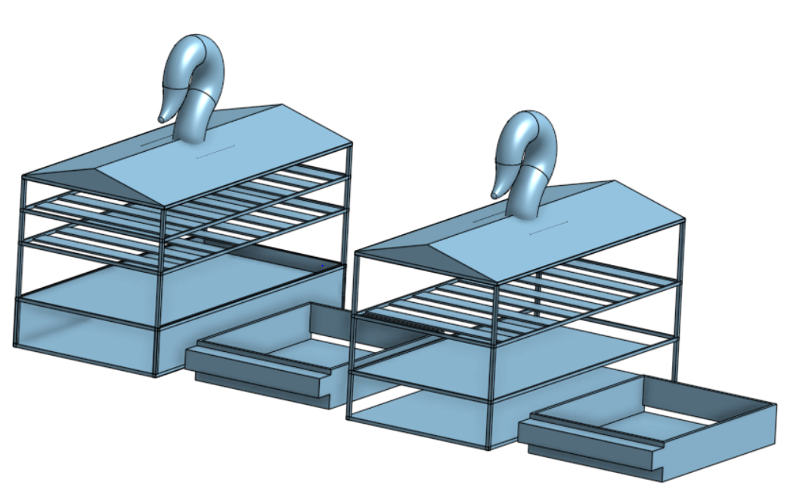
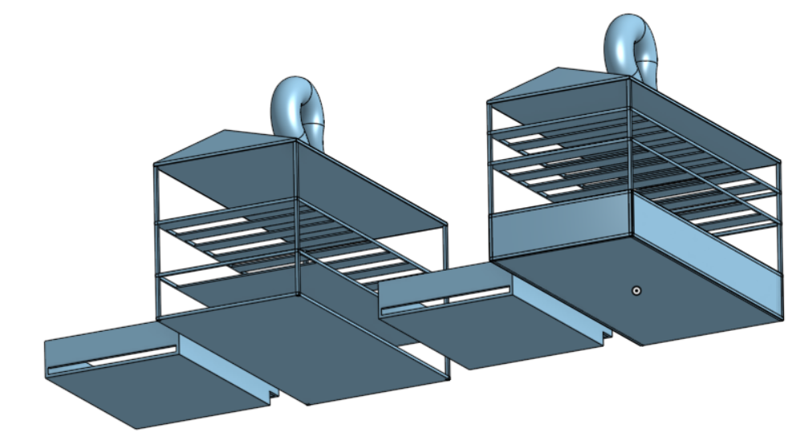

# Physical Detailed Design

This document presents a comprehensive overview of the Physical Subsystem, one of the four key components of the greenhouse monitoring solution—the others being the Power Subsystem, Central Processing Hub Subsystem, and Mechanical Subsystem. The Physical Subsystem is on the lower end of the components but requires a fair amount of tinkering to get accurate. The document further outlines the technical constraints, relevant industry standards, and operational limitations that influence the design and deployment of the Physical Subsystem. Lastly, it details the step-by-step procedure for constructing and implementing the subsystem as part of the overall greenhouse monitoring solution.
## Function of the Subsystem

The Remote Box Cases play a crucial role in the greenhouse monitoring system by holding all the other subsystems together, providing a ease of access to components, and ease of mobile movement of the boxes. Each box will contain ESP-WROOM-32 microcontroller, printed circuit board (PCB), BME280 sensor (which measures relative humidity, barometric pressure, and ambient temperature), BH1750 (used for light intensity measurement), SCD40 (dedicated to CO₂ monitoring), Gravity Electrochemical Oxygen Sensor (for detecting oxygen levels), and a battery connection box (four batteries). These Remote Box Cases will be made out of PETG filament to ensure moisture and temperature resistance to the box.

## Specifications and Constraints

The physical enclosure for the sensor subsystem shall be designed to house the ESP-WROOM-32 microcontroller and its associated environmental sensors (BME280, BH1750, SCD40, and Gravity Electrochemical Oxygen Sensor) in a compact, durable, and functional case. The case must support the sensor array's environmental monitoring function while ensuring mechanical protection, proper sensor exposure, and system longevity within the greenhouse setting.

### Design Specifications:

- Component Housing:
The case shall securely accommodate a custom PCB with the ESP-WROOM-32 and all associated sensors. The internal geometry must account for component dimensions, connector clearances, and mounting standoffs.
- Sensor Accessibility:
Openings or breathable membranes must be integrated to allow unobstructed sensing of environmental variables:
  - Perforated vent area for temperature, humidity, and pressure (BME280)
  - Transparent or translucent window for light intensity sensing (BH1750)
  - Direct air exposure ports for gas sensors (SCD40 and Oxygen sensor), while preventing debris ingress
-	Material Selection:
The enclosure shall be constructed from UV-resistant, corrosion-resistant, and RoHS-compliant plastics (e.g., ASA, ABS, or PC blends). Materials must be non-reactive and safe for prolonged greenhouse use.
-	Ingress Protection:
The case shall achieve at least IP54 rating to guard against dust accumulation and water splashes, while still allowing necessary airflow for accurate environmental readings.
-	Mounting & Placement:
The design shall feature integrated mounting flanges or slots for zip ties or screws, enabling secure attachment to greenhouse infrastructure (e.g., poles or walls). The orientation must support optimal sensor function and wireless signal strength.
-	Thermal Management:
Passive ventilation shall be included to prevent internal heat buildup, especially around the microcontroller and sensors sensitive to temperature deviations.
-	Assembly & Maintenance:
The enclosure shall use snap-fit mechanisms or minimal fasteners for ease of assembly and field maintenance. Design shall allow access to the PCB for diagnostics or upgrades without compromising structural integrity.
- Component Dimensions for Remote Box Case

| **Component**                   | **Dimensions (L × W × H)**              |
|--------------------------------|-----------------------------------------|
| ESP-WROOM-32 (module)          | 53.6 mm × 25.4 mm × 10.9 mm             |
| BME280 (sensor module)         | ~12 mm × 10 mm × 3.5 mm                 |
| BH1750 (sensor module)         | ~20 mm × 16 mm × 3.5 mm                 |
| SCD40 (CO₂ sensor)             | 10.1 mm × 10.1 mm × 6.5 mm              |
| Gravity Electrochemical O₂     | ~32 mm × 22 mm × 17 mm                  |
| MT3608 Boost Converter         | 37 mm × 17 mm × ~4 mm                   |
| Camera Module                  | 56.6 mm × 47.7 mm × 29.4 mm             |
| Battery Holder (4xAA)          | ~76 mm × 60 mm × 19 mm                  |
| Custom PCB (approx.)           | ~80 mm × 50 mm                          |

### Design Constraints:
- Dimensional Limits:
The case size is 127mm x 63.5mm x 73.41mm (LxWxH) in outer dimensions to maintain portability and ease of deployment across multiple greenhouse locations.
- Environmental Exposure:
The case must withstand ambient greenhouse conditions, including high humidity (up to 100%), temperatures ranging from 5°C to 50°C, and prolonged exposure to moisture and soil particulates.
- Safety Compliance:
All physical design elements must align with OSHA 29 CFR 1910 Subparts S, 1200, 1000, and 39, addressing electrical safety, hazardous communications, air contaminant limits, and fire protection. No sharp edges, exposed conductors, or flammable materials shall be present in the case construction.
- Manufacturability:
The design shall be optimized for additive manufacturing (3D printing) using common FDM-compatible materials, minimizing support structures, overhangs, and print time. Tolerances must support reliable post-processing and fitting of electronic components.
- Cost & Material Efficiency:
The enclosure shall be cost-effective for small-batch production, with minimal material waste and efficient use of printable volume.

## Overview of Proposed Solution
The proposed solution involves the development of a custom 3D-modeled enclosure designed to house the ESP-WROOM-32 microcontroller and its associated environmental sensors (BME280, BH1750, SCD40, and Gravity Electrochemical Oxygen Sensor). The enclosure is tailored to meet the physical, environmental, and functional specifications required for reliable deployment within a greenhouse setting.

The enclosure will be 3D printed using PETG filament, selected for its excellent resistance to moisture, UV exposure, and temperature fluctuations—conditions commonly present in greenhouse environments. PETG also offers strong layer adhesion and durability, ensuring the case remains structurally sound over time while being environmentally safe and RoHS-compliant.

Internally, the case will feature precision mounts and compartments to securely hold the custom PCB and electronic components in place. External design elements will include:

- Ventilation slots or mesh-covered cutouts to allow air circulation for gas and humidity sensors.
- A transparent or translucent window over the light sensor (BH1750) for accurate illumination readings.
- Openings or filtered ports for gas sensors to ensure exposure to ambient air without allowing dust or debris inside.
  
The enclosure will meet at least an IP54 rating, providing protection against dust and splashing water while allowing proper airflow. Integrated mounting flanges and rail slots will enable secure attachment to greenhouse poles or walls, keeping the unit stable and optimally oriented for sensing.

To maintain proper thermal conditions and sensor accuracy, passive ventilation features will be included in the design, preventing heat buildup around temperature-sensitive electronics. Additionally, the case will incorporate snap-fit or screw-secured closures to simplify assembly and allow access for maintenance or sensor upgrades.

The 3D model will be optimized for efficient FDM printing using PETG, minimizing support structures and ensuring material efficiency without compromising structural integrity.

By leveraging the mechanical and chemical resilience of PETG along with a purpose-built design, this solution meets all outlined constraints—ranging from environmental protection and fire safety to OSHA compliance and ease of manufacturing—while ensuring the sensor subsystem operates effectively within the greenhouse environment.

## Interface with Other Subsystems
The 3D-modeled sensor case serves as the physical interface between the environmental sensing hardware and the broader greenhouse monitoring system. While it is a passive mechanical component, its design directly impacts the quality, reliability, and functionality of the data collected and transferred by the sensor subsystem. The enclosure ensures that each internal component can effectively perform its intended function while safely interfacing with other subsystems.

### Inputs to the Enclosure:
- Ambient Environmental Conditions:
The enclosure is designed to allow unimpeded input of key environmental variables, including:
  - Air temperature, humidity, and pressure (BME280)
  - Light intensity (BH1750)
  - Carbon dioxide (CO₂) concentration (SCD40)
  - Oxygen levels (Gravity Electrochemical O₂ Sensor)
These inputs enter the enclosure via strategically designed ventilation slots, filtered air inlets, and light-transmitting windows, ensuring sensors receive accurate environmental exposure.
- Electrical Power Supply (via PCB):
The case allows routed access for a low-voltage (≤5V) DC input through either a sealed cable gland or dedicated port, depending on deployment method (e.g., USB, Li-ion battery, or solar power source).

### Outputs from the Enclosure:
- Environmental Data Transmission (via ESP-WROOM-32):
The onboard ESP-WROOM-32 microcontroller collects data from all integrated sensors and transmits it wirelessly over Wi-Fi to the central processing hub (Raspberry Pi). While the enclosure does not directly manage data, it ensures:
  - Sufficient antenna clearance or non-metallic casing in key areas to allow for strong, uninterrupted wireless communication
  - Proper sensor exposure so the data collected is accurate and usable
- Heat Dissipation:
As a physical output, passive airflow channels are built into the case to allow heat generated by the electronics to escape, preventing thermal buildup that could affect component performance or readings.

### Data Characteristics and Communication:
- Data Format:
The data transmitted from the ESP-WROOM-32 is formatted as structured JSON or MQTT payloads, each containing a unique device identifier and timestamped sensor readings. This allows the central Raspberry Pi to distinguish data from multiple distributed units.
- Communication Method:
  - Wireless Protocol: Wi-Fi (IEEE 802.11 b/g/n)
  - Data Rate: Low-bandwidth sensor packets transmitted at defined intervals (e.g., every 30 seconds to 5 minutes)
  - Direction: One-way transmission from each sensor unit to the Raspberry Pi

### Mechanical Interfaces:
- Mounting Interface:
The case includes slots and flanges for integration with greenhouse infrastructure. This ensures the enclosure is securely positioned and oriented, which is essential for consistent sensor readings and stable wireless communication.
- Serviceability Interface:
The enclosure allows for non-invasive access to internal components via snap-fit lids or screw panels, enabling sensor or PCB maintenance without detaching the entire subsystem from its location.

## 3D Model of Sensor Units

- Front View:
  

- Rear View:
  

## Bill of Materials (BOM)

| Manufacturer                 | Part Number                                         | Distributor | Distributor Part Number | Quantity | Price      | Purchasing Website URL                                                                                                                                                                                                                                                                                                                                                        |
|------------------------------|-----------------------------------------------------|-------------|-------------------------|----------|------------|--------------------------------------------------------------------------------------------------------------------------------------------------------------------------------------------------------------------------------------------------------------------------------------------------------------------------------------------------------------------------------------|
| Creality                       | PETG Filament                                     | Amazon      | null                   | 1        | $17.99 | [Link](https://www.amazon.com/CREALITY-PETG-Filament-Dimensional-Black/dp/B0CRLGHWZF/ref=sr_1_1_sspa?dib=eyJ2IjoiMSJ9.yf4QrGfdb01bS0owhB7XaPtXE_o7pZRF3QizKnbgOp2FMAYczqeqdkjwHkYkt19UMm3t0lSctARuqbWB3QffX5cMTKEo7SNFp2VtnWi6ht7PI96nC95HtGC-b2vwNnjrUJ0nSDhZFryZna5GIeCR5WjIeKkl6cw7lGirsoNGqDesm8b2JrUyyWzjEjmgDBty-_nzhJbTCJH9d4-sCxJyYHoq02cPF-cBss0DG3WF7B8.2luK1lZG7mSvF8z_tehzyqiDQt2gRCVWDJROnuUOqxk&dib_tag=se&keywords=PETG+filament&qid=1745203043&sr=8-1-spons&sp_csd=d2lkZ2V0TmFtZT1zcF9hdGY&psc=1) |
| **Total** |                                                     |             |                         |          | **$17.99** |                                                                                                                                                                                                                                                                                                                                                                          |

## Analysis
The proposed PETG 3D-printed sensor case successfully fulfills all functional and environmental requirements for greenhouse deployment. Its internal layout securely houses the ESP-WROOM-32 and associated sensors, while the angled ventilation slats allow direct exposure to ambient air and light for accurate environmental readings. The integrated hook enables easy suspension at canopy level for optimal data collection. The 1.27 mm wall thickness provides sufficient structural strength while keeping filament use low, making the design both durable and cost-effective. PETG's resistance to moisture, UV, and moderate heat makes it well-suited for long-term greenhouse use.

From a compliance standpoint, the design meets multiple OSHA standards for electrical safety, hazardous communication, and air quality by enclosing electronics in a non-conductive, chemically stable PETG shell. It also adheres to RoHS requirements, ensuring eco-friendly materials are used throughout. The non-metallic construction ensures uninterrupted Wi-Fi connectivity for seamless data transmission to the Raspberry Pi hub. Overall, the sensor case is safe, scalable, and optimized for both performance and environmental compatibility in a greenhouse monitoring system.

## References
[1] Espressif Systems. (2022). ESP-WROOM-32 Datasheet. Retrieved from https://www.espressif.com
‌  
[2] Bosch Sensortec. (2018). BME280 Combined Humidity and Pressure Sensor Datasheet. Retrieved from https://www.bosch-sensortec.com
‌  
[3] ROHM Semiconductor. (2017). BH1750 Digital Ambient Light Sensor. Retrieved from https://www.rohm.com
‌  
[4] Sensirion AG. (2021). SCD40 Miniature CO₂ Sensor Datasheet. Retrieved from https://www.sensirion.com
‌  
[5] DFRobot. (2022). Gravity Electrochemical Oxygen Sensor. Retrieved from https://www.dfrobot.com
‌  
[6] Creality. (2024). PETG 3D Printing Filament Product Description. Retrieved from https://www.amazon.com/CREALITY-PETG-Filament-Dimensional-Black/dp/B0CRLGHWZF
‌  
[7] Occupational Safety and Health Administration (OSHA). (2023). 29 CFR 1910 Subpart S, Subpart Z, and others. Retrieved from https://www.osha.gov/laws-regs
‌  
[8] European Commission. (2022). Directive 2011/65/EU on the Restriction of Hazardous Substances (RoHS). Retrieved from https://ec.europa.eu
‌  
[9] International Electrotechnical Commission (IEC). (2013). IEC 60529: Degrees of protection provided by enclosures (IP Code). Retrieved from https://www.iec.ch
‌  
[10] IEEE. (2016). IEEE 802.11 Standards for Wireless LAN. Retrieved from https://standards.ieee.org
‌  

