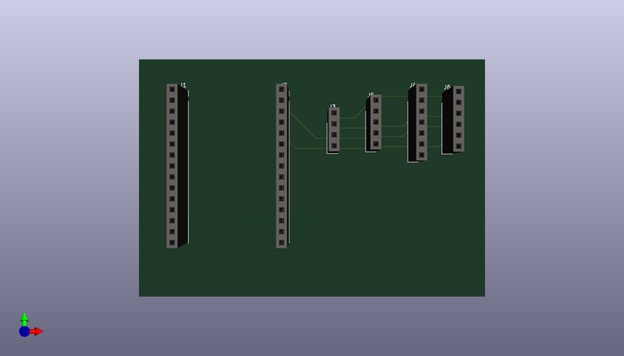
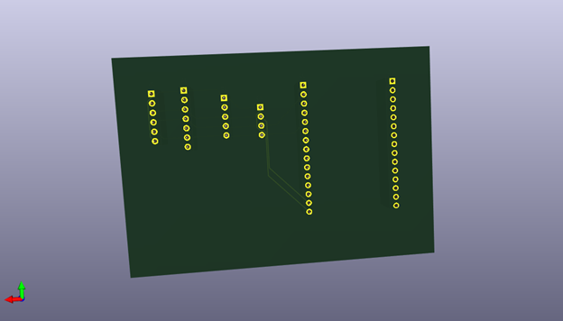
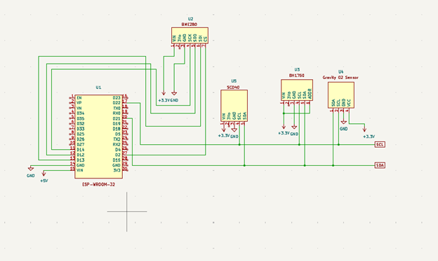
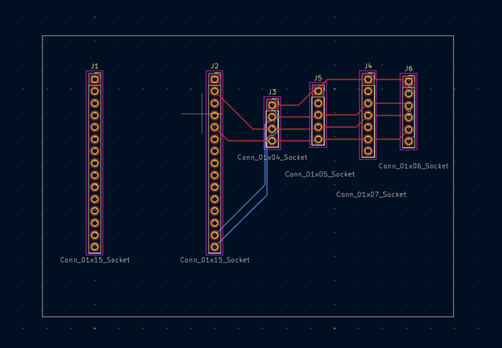
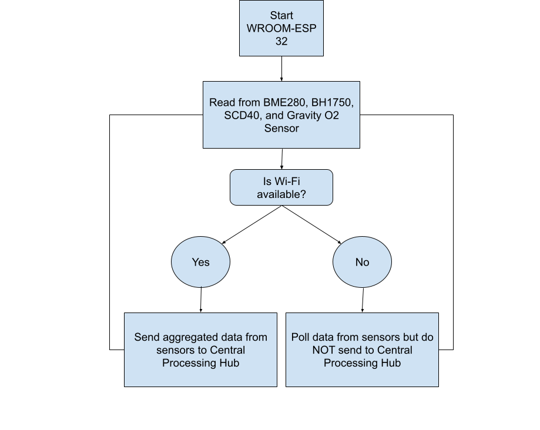

# Sensor Unit Detailed Design 

This document presents a comprehensive overview of the Sensor Subsystem, one of the four key components of the greenhouse monitoring solution—the others being the Power Subsystem, Central Processing Hub Subsystem, and Mechanical Subsystem. While the primary focus is on the Sensor Subsystem, a high-level integration overview with the remaining subsystems is also provided to highlight system interdependencies and ensure cohesive functionality. The document further outlines the technical constraints, relevant industry standards, and operational limitations that influence the design and deployment of the Sensor Subsystem. Lastly, it details the step-by-step procedure for constructing and implementing the subsystem as part of the overall greenhouse monitoring solution
## Function of the Subsystem

The remote sensor units play a crucial role in the greenhouse monitoring system by communicating with each other and transmitting aggregated environmental data to the central processing hub, a Raspberry Pi. Each unit is built around the ESP-WROOM-32 microcontroller and integrates multiple environmental sensors to capture a comprehensive range of parameters. These include the BME280 sensor, which measures relative humidity, barometric pressure, and ambient temperature; the BH1750, used for light intensity measurement; the SCD40, dedicated to CO₂ monitoring; and the Gravity Electrochemical Oxygen Sensor for detecting oxygen levels. All sensors are mounted on a printed circuit board (PCB) alongside the ESP-WROOM-32, enabling compact design and facilitating streamlined prototyping and deployment.

For communication, each ESP-WROOM-32-based remote sensor unit will utilize Wi-Fi to establish a wireless connection with the central processing hub. To ensure accurate data management, every sensor unit will be assigned a unique device identifier, allowing the central hub to differentiate incoming data streams and avoid any potential overwriting of information. As real-time environmental data is collected from the onboard sensors, it is transmitted to the Raspberry Pi for processing and visualization on the system's website dashboard. In the event of network downtime or offline operation, the Raspberry Pi is equipped with an SD card that serves as a local storage solution, retaining the latest recorded data from each sensor unit to ensure data integrity and continuity.

## Specifications and Constraints
The sensor subsystem shall monitor and record critical environmental parameters—temperature, humidity, and barometric pressure using the BME280; light intensity using the BH1750; carbon dioxide (CO₂) concentrationusing the SCD40; and oxygen levels using the Gravity Electrochemical Oxygen Sensor—across multiple locations within the greenhouse environment to ensure comprehensive spatial data coverage and real-time condition tracking.

1. Electrical Safety Compliance

The sensor units shall comply with OSHA 29 CFR 1910 Subpart S, which pertains to electrical safety requirements. The ESP-WROOM-32 microcontroller shall interface with the sensors via a printed circuit board (PCB), and soldering shall be employed to ensure mechanically and electrically secure joints. All conductor endpoints shall be properly insulated, and all wiring and connections shall be adequately grounded to prevent electric shock. The system shall be limited to a maximum power delivery of 50 volts or less to align with OSHA's defined safe voltage thresholds.

2. Hazardous Communication Compliance

The sensor subsystem shall comply with OSHA 29 CFR 1910.1200 regarding hazardous communications. Since the PCB will be deployed in a greenhouse environment, the materials used in its construction shall not emit substances that could negatively impact plant or soil health. All components shall be selected to minimize chemical risks and maintain ecosystem compatibility.

3. Air Contaminant Compliance

The subsystem shall adhere to OSHA 29 CFR 1910.1000, which addresses permissible exposure limits for air contaminants. The PCB materials shall be chosen to ensure that, under operational temperatures, no harmful gases are emitted that could degrade air quality or pose risks to greenhouse occupants or flora.

4. Environmental Protection (RoHS Compliance)

The subsystem shall comply with Restriction of Hazardous Substances (RoHS) standards for environmental sustainability. All soldering materials used for mounting PCB connectors shall be RoHS-compliant, ensuring they are free from substances harmful to the environment and greenhouse conditions.

5. Fire Safety Compliance

The PCB and associated components shall comply with OSHA 29 CFR 1910.39 concerning fire safety. The subsystem shall incorporate flame-retardant materials and designs capable of withstanding varying temperature conditions throughout its deployment cycle, thereby reducing fire hazards.

## Overview of Proposed Solution

Given that the sensor units will be deployed in a greenhouse environment characterized by fluctuating climate conditions, each sensor shall be rated to operate reliably within the standard greenhouse temperature range of 45°F to 85°F. To ensure safe and modular connectivity between the ESP32 microcontroller and its associated sensors, the system shall adhere to National Fire Protection Association (NFPA) 70, also known as the National Electric Code (NEC). These guidelines will govern the wiring and installation practices to ensure electrical safety within moist and plant-dense environments. Furthermore, recognizing the environmental sensitivities and potential communication barriers posed by greenhouse structures and vegetation, the subsystem shall comply with OSHA 29 CFR 1910.1200, which addresses hazardous communications. To meet this requirement, the printed circuit board (PCB) shall be fabricated using non-hazardous materials, such as tin-based solder and flame-retardant substrates, and shall include appropriate hazard labeling. These measures collectively ensure that the sensor subsystem maintains both operational integrity and environmental safety in a biologically sensitive setting.

To comply with OSHA 29 CFR 1910.1000, which regulates exposure to air contaminants, the PCB used in the sensor subsystem shall not contain volatile organic compounds (VOCs) or other hazardous materials that could exceed OSHA’s Permissible Exposure Limits (PELs) within the greenhouse environment. The manufacturing process shall exclude VOCs entirely to ensure air quality and occupant safety. In alignment with environmental protection standards, the PCB shall also limit hazardous substances such as lead and mercury, and each board shall be clearly labeled to indicate Restriction of Hazardous Substances (RoHS) compliance. This ensures that the subsystem poses no ecological risk to the greenhouse ecosystem. Lastly, to fulfill fire safety requirements per OSHA 29 CFR 1910.39, the PCB composition shall include flame-retardant materials designed to withstand thermal stress, reducing the risk of combustion during prolonged operation under variable greenhouse conditions.

## Interface with Other Subsystems

As one of the four primary components of the greenhouse monitoring solution, the sensor subsystem interfaces closely with the power, central processing hub, and mechanical subsystems. The power electronic subsystem shall provide regulated power to the ESP-WROOM-32 microcontroller and its connected sensors—BME280, BH1750, SCD40, and the Gravity Electrochemical Oxygen sensor—via a USB-C interface. This standardized connection ensures efficient and reliable power delivery. Once powered, the ESP32 will distribute voltage to each sensor through integrated PCB traces, streamlining internal connectivity and minimizing wiring complexity. Upon initialization, the ESP32 shall communicate with all onboard sensors using the I²C protocol to collect environmental data. This aggregated data shall then be transmitted to the central processing hub subsystem, a Raspberry Pi, over a local Wi-Fi network. The mechanical subsystem will provide structural support and environmental shielding for the sensor module, ensuring stable operation under greenhouse conditions. This coordinated interaction among subsystems ensures a robust, scalable, and integrated monitoring framework.

## 3D Model of Sensor Unit Interconnect PCB

## Buildable Schematic 

## Printed Circuit Board Layout

## Operational Flowchart

## Bill of Materials (BOM)

| Manufacturer                 | Part Number                                         | Distributor | Distributor Part Number | Quantity | Price      | Purchasing Website URL                                                                                                                                                                                                                                                                                                                                                        |
|------------------------------|-----------------------------------------------------|-------------|-------------------------|----------|------------|--------------------------------------------------------------------------------------------------------------------------------------------------------------------------------------------------------------------------------------------------------------------------------------------------------------------------------------------------------------------------------------|
| AITRIP                       | ESP32 DevKit-V1                                     | Amazon      | 15363                   | 3        | $15.99 x 3 | [Link](https://www.amazon.com/ESP-WROOM-32-Development-Microcontroller-Integrated-Compatible/dp/B08D5ZD528?pd_rd_w=iZ0oF&content-id=amzn1.sym.528bfdfa-ea96-478b-a7d9-043e650836af&pf_rd_p=528bfdfa-ea96-478b-a7d9-043e650836af&pf_rd_r=XJM41MWP1F1G4W97R7DR&pd_rd_wg=OPF1h&pd_rd_r=6db91f4b-742a-4e75-b877-a7100e9508ec&pd_rd_i=B08D5ZD528&ref_=pd_basp_d_rpt_ba_s_2_t&th=1) |
| Adafruit                     | Adafruit BME280                                     | Adafruit    | 2652                    | 3        | $14.95 x 3 | [Link](https://www.adafruit.com/product/2652)                                                                                                                                                                                                                                                                                                                               |
| Adafruit                     | Adafruit BH1750                                     | Adafruit    | 4681                    | 3        | $4.50 x 3  | [Link](https://www.adafruit.com/product/4681)                                                                                                                                                                                                                                                                                                                               |
| REHOC                        | SCD40-D-R2                                          | Amazon      | 500247842               | 3        | $21.94 x 3 | [Link](https://www.amazon.com/REHOC-Detects-Dioxide-Temperature-Humidity/dp/B0BWDX1HQ7)                                                                                                                                                                                                                                                                                        |
| Gravity                      | TPX00050                                            | Arduino     | 6959420917020           | 3        | $55.00 x 3 | [Link](https://store-usa.arduino.cc/products/gravity-i2c-oxygen-sensor)                                                                                                                                                                                                                                                                                                    |
| Sullins Connector Solutions (J1 and J2) | PPTC151LFBN-RC | DigiKey | S7013-ND | 6 | $0.89 x 6  | [Link](https://www.digikey.com/en/products/detail/sullins-connector-solutions/PPTC151LFBN-RC/810153) |
| Sullins Connector Solutions (J3) | PPPC041LFBN-RC | DigiKey | S7037-ND | 3 | $0.42 x 3  | [Link](https://www.digikey.com/en/products/detail/sullins-connector-solutions/PPPC041LFBN-RC/810176) |
| Sullins Connector Solutions (J5) | PPTC051LFBN-RC | DigiKey | S6103-ND | 3 | $0.42 x 3  | [Link](https://www.digikey.com/en/products/detail/sullins-connector-solutions/PPTC051LFBN-RC/807239) |
| Sullins Connector Solutions (J6) | PPPC061LFBN-RC | DigiKey | S7039-ND | 3 | $0.47 x 3  | [Link](https://www.digikey.com/en/products/detail/sullins-connector-solutions/PPPC061LFBN-RC/810178) |
| Sullins Connector Solutions (J7) | PPTC071LFBN-RC | DigiKey | S7005-ND | 3 | $0.51 x 3  | [Link](https://www.digikey.com/en/products/detail/sullins-connector-solutions/PPTC071LFBN-RC/810146) |
| JLCPCB                       | N/A                                                  | JLCPCB      | N/A                     | 3        | $19.50 x 3 | [Link](https://jlcpcb.com/)                                                                                                                                                                                                                                                                                                                                               |
| Adafruit                     | Premium Female/Male 'Extension' Jumper Wires - 40 x 6" | Adafruit    | 826                     | 1        | $3.95      | [Link](https://www.adafruit.com/product/826)                                                                                                                                                                                                                                                                                                                               |
| Tenma                        | 21-1046                                              | Amazon      | B001DPVT1A                | 1        | $29.95     | [Link](https://www.amazon.com/Tenma-21-1046-Lead-Rosin-Solder/dp/B001DPVT1A)                                                                                                                                                                                                                                                                                             |
| **Total** |                                                     |             |                         |          | **$475.28** |                                                                                                                                                                                                                                                                                                                                                                          |

## Analysis
### Temperature and RoHS Compliance
The selected use of connectors over fixed soldering for PCB sensor integration in a greenhouse context demonstrates a deliberate design choice driven by flexibility and compliance with safety and environmental regulations. The use of female-male jumper wires to connect dynamic components such as the BME280, BH1750, SCD40, and Gravity Electrochemical Oxygen sensor allows for easy repositioning to optimize sensor placement, which is essential for spatially varied greenhouse environments. This modular approach aligns with OSHA 29 CFR 1910 Subpart S standards by ensuring safe operation under expected temperature ranges. Each component and connector operates safely within the specified environmental conditions—connectors rated from -40°C to 105°C far exceed the maximum 30°C greenhouse environment, while sensors operate within ranges comfortably exceeding this upper limit. The ESP32 microcontroller, BME280, and BH1750 tolerate up to 85°C, the SCD40 up to 60°C, and the oxygen sensor up to 50°C, ensuring robustness across all nodes. 

Importantly, the PCB’s RoHS compliance is reinforced by the use of tin-copper lead-free solder, which not only avoids OSHA-prohibited lead content under 1910.1200 and 1910.1000 but also ensures high thermal durability with a melting point of 227°C—well beyond greenhouse conditions. Additionally, silkscreen adherence to environmental standards further supports RoHS compliance. Overall, this component selection and assembly strategy ensures environmental safety, functional flexibility, and regulatory alignment within the operational framework of greenhouse monitoring.

### Sensors for Greenhouse Usage
Each sensor integrated into the subsystem was carefully chosen not just for its measurement capabilities, but for its environmental durability, accuracy under varying greenhouse conditions, and relevance to plant health and productivity. Greenhouses present unique challenges including high humidity, temperature fluctuations, and potential interference from plant transpiration or condensation—factors these sensors are particularly designed to withstand.

The BME280 (Temperature, Humidity, and Pressure Sensor) is an ideal environmental sensor for greenhouse monitoring due to its ability to simultaneously measure three vital parameters—temperature, humidity, and barometric pressure—in a compact, energy-efficient form. Greenhouses often experience fluctuations in temperature and humidity due to external weather conditions and internal irrigation or misting systems. The BME280 maintains accuracy even under these variable conditions, offering ±1.0°C for temperature, ±3% for relative humidity, and ±1 hPa for pressure. Its high resolution—0.01°C for temperature, 0.008% for humidity, and 0.18 Pa for pressure—enables fine-grained monitoring necessary for early detection of environmental changes. The sensor's repeatability of ±0.12°C and ±0.12% RH ensures consistent performance across readings, even after restarts or over long deployments. With a sample rate of up to 25 Hz, though typically configured at 1 Hz in greenhouse applications, it meets the necessary requirements for balance between data granularity and power efficiency.

The BH1750 (Ambient Light Sensor) is specifically well-suited for greenhouse environments where light levels directly affect plant photosynthesis and artificial lighting schedules. This digital light sensor measures a broad lux range from 1 to 65,535 lux with a 1 lux resolution, providing sufficient sensitivity for both shaded and well-lit areas. Its typical accuracy is ±20%, and under stable lighting, it offers a repeatability of approximately ±2 lux, which is effective for detecting daily light cycles and ensuring consistent lighting conditions. Sampling speeds range from 16 milliseconds in low-resolution mode to 120 milliseconds in high-resolution mode, enabling real-time feedback without significant processing delay. Its stability under changing light conditions and diffused light—common in greenhouses with polycarbonate or glass coverings—makes it invaluable for obtaining data on lighting conditions.

In controlled-environment agriculture such as a greenhouse, CO₂ concentration is a critical variable for promoting plant growth, and the SCD40 (CO₂ Sensor) is optimized for this role. It uses photoacoustic NDIR technology, which is more resistant to contamination and humidity interference than traditional optical methods. This makes it highly reliable in humid greenhouse settings. The sensor provides CO₂ readings with an accuracy of ±(40 ppm + 5% of the reading) over a typical range of 400 to 2000 ppm. It also measures temperature and humidity to internally compensate for environmental drift, ensuring accuracy over time. The SCD40 operates at a configurable sample rate—typically set to 1 Hz in greenhouse use cases—and offers a fine resolution of 1 ppm, with repeatability around ±10 ppm under stable conditions. Its automatic self-calibration reduces maintenance demands and ensures long-term accuracy in enclosed environments with varying ventilation rates.

The Gravity Electrochemical Oxygen Sensor is particularly effective for monitoring ambient oxygen levels in greenhouse environments, where microbial activity, plant respiration, and ventilation performance can all impact O₂ availability. This sensor is engineered for continuous analog output and is polled in real time by the ESP-WROOM-32 microcontroller. It features an accuracy of ±3% full scale over a 0–25% oxygen volume range, with a resolution of 0.1% and repeatability of ±0.1% under consistent environmental conditions. Its electrochemical design is inherently resistant to high humidity and temperature variations, key characteristics of greenhouse atmospheres. Additionally, its chemical stability allows for prolonged deployment without the need for frequent recalibration, making it well-suited for low-maintenance environmental sensing in biologically active zones such as near soil beds or composting stations within a greenhouse.

To summarize, these sensors offer robust, high-resolution, and repeatable monitoring across key environmental variables. Their resilience to the high humidity, dynamic lighting, and temperature fluctuations typical of greenhouse environments ensures that the system delivers accurate data essential for plant health and environmental optimization.

## References

[1] Nfpa.org, 2024. https://www.nfpa.org/codes-and-standards/nfpa-70-standard-development/70
‌  
[2] “1910 Subpart S - Electrical | Occupational Safety and Health Administration,” www.osha.gov. https://www.osha.gov/laws-regs/regulations/standardnumber/1910/1910SubpartS
‌  
[3] OSHA, “1910.1200 - Hazard Communication. | Occupational Safety and Health Administration,” Osha.gov, 2012. https://www.osha.gov/laws-regs/regulations/standardnumber/1910/1910.1200
‌‌  
[4] “1910.1000 - Air contaminants. | Occupational Safety and Health Administration,” www.osha.gov. https://www.osha.gov/laws-regs/regulations/standardnumber/1910/1910.1000
‌‌  
[5] European Commission, “RoHS Directive,” environment.ec.europa.eu, 2024. https://environment.ec.europa.eu/topics/waste-and-recycling/rohs-directive_en
‌  
‌[6] OSHA, “1910.39 - Fire prevention plans. | Occupational Safety and Health Administration,” Osha.gov, 2020. https://www.osha.gov/laws-regs/regulations/standardnumber/1910/1910.39
‌‌  
[7] “ESP32 Pinout Reference,” Last Minute Engineers, Feb. 05, 2022. https://lastminuteengineers.com/esp32-pinout-reference/
‌  
[8] “BME280 -Data sheet,” 2020. Available: https://www.bosch-sensortec.com/media/boschsensortec/downloads/datasheets/bst-bme280-ds002.pdf
‌  
[9] “Digital 16bit Serial Output Type Ambient Light Sensor IC BH1750FVI.” Available: 
https://www.mouser.com/datasheet/2/348/bh1750fvi-e-186247.pdf
‌  
[10] Sensirion AG, “SCD40 - Compact & cost-effective photoacoustic NDIR CO2 sensor,” Sensirion.com, 2024. https://sensirion.com/products/catalog/SCD40
‌  
‌[11]“dfrobot.com,” Dfrobot.com, 2025. https://www.dfrobot.com/product-2052.html
‌  
[12]“Ideal Greenhouse Temperature And Humidity,” Atlas Scientific, Jul. 28, 2022. https://atlas-scientific.com/blog/ideal-greenhouse-temperature-and-humidity/
‌  
