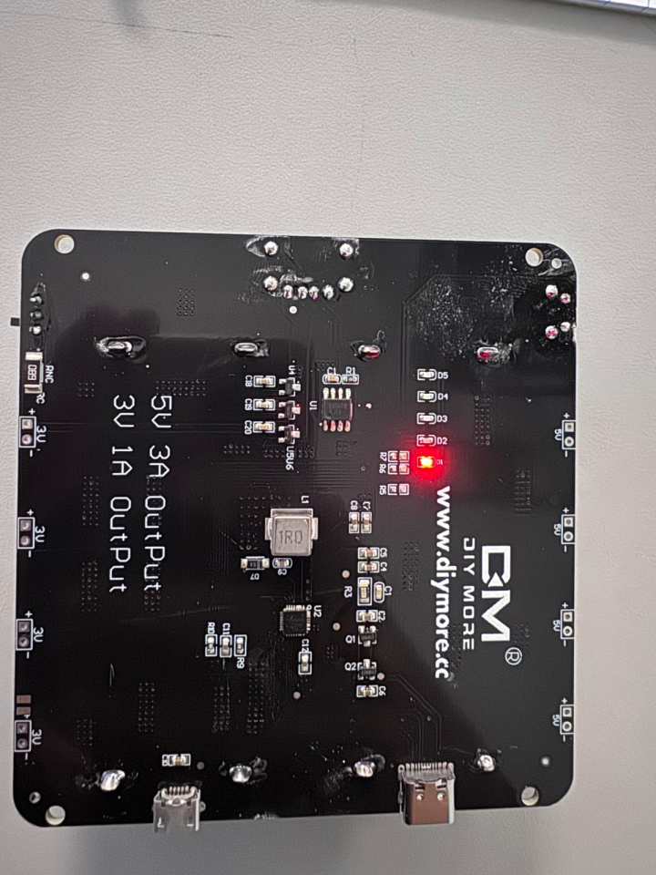
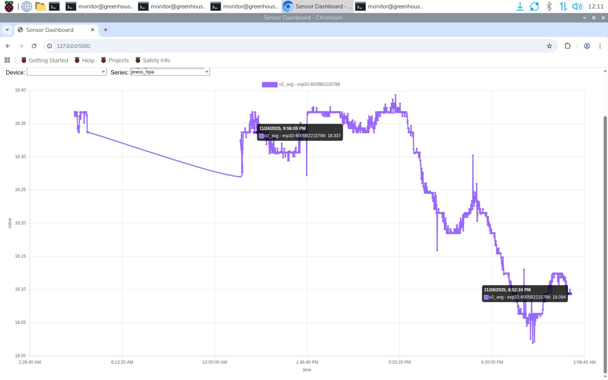
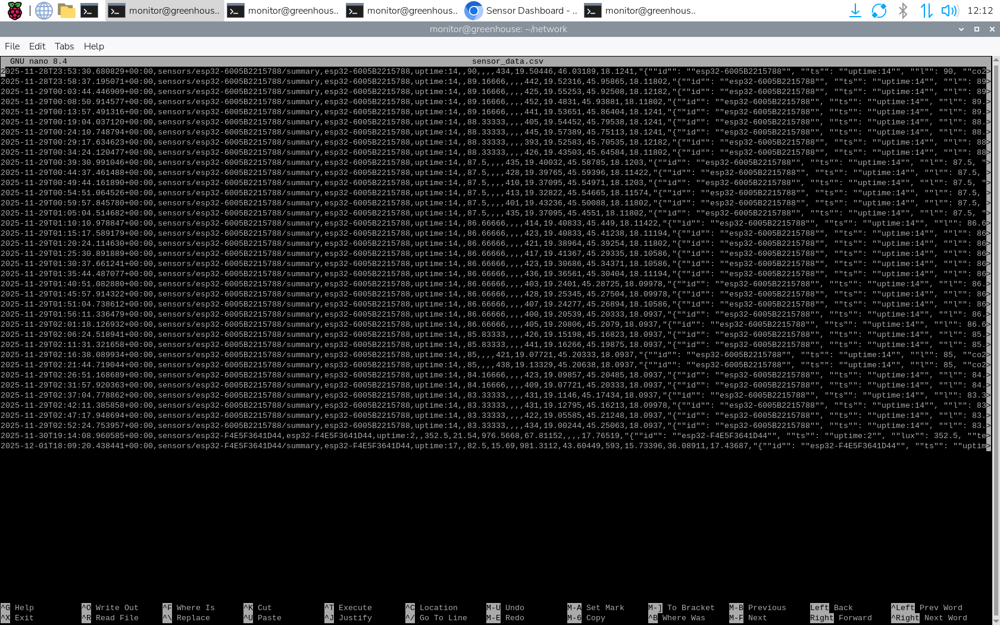

# Experimental Analysis

## Introduction

This experimental analysis revisits the conceptual design of our greenhouse sensor units. The project's overarching goal was to design and develop a portable, modular data collection system that operates reliably in various environments. 

Based on conceptual design, the most critical requirements and success criteria pertain to the system’s overall battery life and wireless communication to a central processing unit. As such, the subsystems have been combined to effectively test these two success criteria.

### Relevant Critical Success Criteria

**Specification 1:** Batteries shall be able to operate for a minimum of 72 hours before recharging. This requirement reflects the practical need for uninterrupted monitoring in real-world greenhouse operations.  

**Specification 2:** Each module shall track its battery level and alert users when recharging or replacement is necessary. A system that silently fails is unacceptable; proactive alerts ensure reliability.  

**Specification 3:** Collected data shall be transmitted wirelessly from each module to the central processor for real-time monitoring. Wires are impractical in modular deployments, so wireless communication is essential.  

**Specification 4:** The central processor shall transmit data to a cloud platform when Wi-Fi connectivity is available. This bridges the greenhouse environment with remote monitoring capabilities.  

**Specification 5:** In the absence of network connectivity, modules shall store data locally to ensure no data loss for offloading. Reliability means resilience against connectivity interruptions.  

**Specification 6:** The cloud platform shall display live data and retain historical data for analysis and monitoring. This ensures both immediate awareness and long-term insight.  

---

## Experiment One: Battery Lifespan

### Purpose and Justification
This is an experiment that aims to combine specifications 1 and 2 for the purpose of testing the battery lifespan of the overall sensor unit. Specification 1 addresses the customer specification for the sensor unit to last before a battery change. As such the sensor units will be in operation for at least three days. Specification 2 addresses the physical indication for when the battery needs to be changed after three days. Therefore, this experiment aims to test the lifespan of the battery for the sensor units using the indication given by the battery subsystem.  

### Detailed Procedure
This test involves keeping the ESP32 sensor units connected to the BME280 (Humidity), BH1750 (Light), SCD40 (CO2), and Gravity Sensors (O2). While connected to the battery subsystem, the ESP32 will continue to parse the sensors to gather information and send this information to the central processing unit running on a Raspberry Pi. This test will be performed over a span of three days with each day the battery unit indicator will be monitored and recorded.  

Figure 1. The LED indicator shown illustrates the battery-level status. When the batteries are fully charged, all upper LEDs illuminate solid red. As the charge decreases, only the lowest LED remains solid, indicating the battery level has dropped below 20%. When the lowest LED begins flashing, it signifies that the batteries are nearly depleted, and the system is out of power.   

### Expected Results
The ESP32 sensor units are expected to last for at least 72 hours with sleep mode enabled and the battery indicator being at full capacity at the beginning of the test (four full bars) and zero capacity at the end (zero full bars by the end).  

### Actual Results
The ESP32 module depleted its power supply after approximately 55 hours of continuous operation. The root cause was identified as the sleep-mode functionality not being enabled, resulting in significantly higher power consumption than intended. Despite this, the battery subsystem performed within expected parameters. 

### Interpretation and Conclusions
Based on our power-draw calculations for a non–sleep-mode operating condition, the projected runtime was 62.8 hours x 0.90 (efficiency)= 56.52 hours. The measured runtime of 55 hours confirms that both the battery cells and the battery shield’s 5 V regulation stage are operating correctly and exhibit no performance deficiencies. With sleep mode properly implemented, the system’s average current draw will be substantially reduced. Under these conditions, the projected operational lifetime increases to approximately 10 days, consistent with our design calculations.

---

## Experiment Two: Sensor Data Collection and Storage

### Purpose and Justification
This is an experiment that aims to combine specifications 3, 4, 5, and 6 for the purpose of interfacing the ESP32 sensor units with the central processing Pi. Specification 3 addresses the customer's specification for the sensor unit to work without the need for wires. As such, the sensor units communicate wirelessly through Wi-Fi. Specifications 4, 5, and 6 address the need for easy data collection. As such, there will be a website that collects all of the data for display and an offline storage system. This experiment aims to test the lifespan of data collection when fully connected over the span of many days and the ability to operate online and offline.   

### Detailed Procedure
This experiment will involve the Raspberry Pi (central processing unit) and an ESP32 sensor unit. For the purpose of testing online and offline data collection and display, both subsystems will be plugged into an outlet for a constant source of power. For the online data collection and display, the ESP32 units are flashed to parse the sensors to attain data and send to the Pi. This data is displayed on the website. For the offline testing, over the span of 3 days, the Pi will parse the ESP32 units and store the data on a SD card.  

### Expected Results
The Pi and ESP32 units should be able to gather information on Co2, O2, humidity, and temperature over the span of 3 days. This information should then be displayed on a website. In offline operations, the information is then successfully stored and accessed from the SD card on the Pi.

### Actual Results
The Raspberry Pi successfully interfaced with the ESP32 boards to receive their collected sensor data. The Pi functionally hosts a website that displays the data in real-time. As shown by the timestamps, the setup worked perfectly for over three days.

Figure 2. The data collected over the three-day test is displayed above. Each datapoint shows the date and time it was collected with a mouseover.

Figure 3. The above screenshot depicts the onboard SD card storage of the Pi, which is holding the data for offline use. It is able to be downloaded for offboard data processing.

### Interpretation and Conclusions
The Pi and ESP32 units successfully collected data over the span of 3 days. Data was collected about every 5 minutes by both boards after being set up. The graphs accurately represent the data collected and draw loose connection lines between points to imply inferred datapoints. The Pi’s SD card stores all the data in .csv format, which is readily compatible with Microsoft Excel for easy data management and manipulation. 

Future iterations could more precisely approach an exact ‘n’ minutes per sample through a timestamp calculation between the ESP32 and the Pi. Additionally, the website only has scales for previous 15 minutes, hour, 24 hours, and 'all time'. A meaningful improvement to this would include a more customizable scale that allows for better viewing.   

---

## Conclusion

This capstone aimed for reliable greenhouse sensor units, but faced constraints from a limited development and testing timeline. However, the majority of the functions provided by our customer, Tennessee Tech Biology Department, were met.  

The interconnect PCB subsystem worked well with interfacing the ESP32 with each of the respective sensors and can communicate with other subsystems. Additionally, the Raspberry Pi central processing unit was successful in parsing each of the sensor units and displaying said information on a website in the event that Wi-Fi is available and on a storage drive locally when Wi-Fi is not available. The battery and chassis subsystem was successful in that it was able to interface with the other subsystems.

---

## Documenting and Tracking Components

The following table documents all components used in the project, their sources, and their conditions. This meticulous tracking ensured transparency and accountability throughout the development process.  

| Item # | Description | Quantity | Vendor/Source | Order #/ID | Storage Location | Date Acquired | Condition | Notes |
|--------|-------------|----------|---------------|------------|------------------|---------------|-----------|-------|
| 1 | ESP32 Boards | 3 | Amazon | 15363 | Lab | 9/3/2025 | New | All used in experiment |
| 2 | BME280 | 3 | Adafruit | 2652 | Lab | 9/3/2025 | New | All used in experiment |
| 3 | BH1750 | 3 | Adafruit | 4681 | Lab | 9/3/2025 | New | One burnt |
| 4 | SCD40-D-R2 | 3 | REHOC | 500247842 | Lab | 9/3/2025 | New | All used in experiment |
| 5 | TPX00050 | 3 | Gravity | 6959420917020 | Lab | 9/3/2025 | New | All used in experiment |
| 6 | PPTC151LFBN-RC | 6 | Sullins Connector Solutions | S7013-ND | Lab | 9/3/2025 | New | All used in experiment |
| 7 | PPPC041LFBN-RC | 3 | Sullins Connector Solutions | S7037-ND | Lab | 9/3/2025 | New | All used in experiment |
| 8 | PPTC051LFBN-RC | 3 | Sullins Connector Solutions | S6103-ND | Lab | 9/3/2025 | New | All used in experiment |
| 9 | PPPC061LFBN-RC | 3 | Sullins Connector Solutions | S7039-ND | Lab | 9/3/2025 | New | All used in experiment |
| 10 | PPTC071LFBN-RC | 3 | Sullins Connector Solutions | S7005-ND | Lab | 9/3/2025 | New | All used in experiment |
| 11 | PCB | 5 | JLCPCB | null | Lab | 9/3/2025 | New | Three used in experiment |
| 12 | Jumper Wires | 240 | Adafruit | 826 | Lab | 9/3/2025 | New | All used in experiment |
| 13 | Solder | 1 | Amazon | B001DPVT1A | Lab | 9/3/2025 | New | Used in experiment |
| 14 | PETG Filament | 1 | Amazon | null | Lab | 9/3/2025 | New | Not used |
| 16 | M3 Standoff Kit | 1 | Amazon | B0D493MPW3 | Lab | 9/3/2025 | New | Used, all remain in lab |
| 17 | Plexiglass Sheet | 1 | Amazon | null | Lab | 9/3/2025 | New | 3 sheets used |
| 18 | Raspberry Pi 4 | 1 | PiShop | 4GB-9004 | Lab | 9/3/2025 | New | Used in experiment |
| 19 | 512 GB SD Card | 1 | Amazon | null | Lab | 9/3/2025

## Statement of Contributions
Duy Tran – Interconnect Subsystem 

Mohammed Almehmadi- Power supply analysis 

Henry Hurst – Documenting and Tracking Components 

Michael Feiel – Data Communication and Website 
