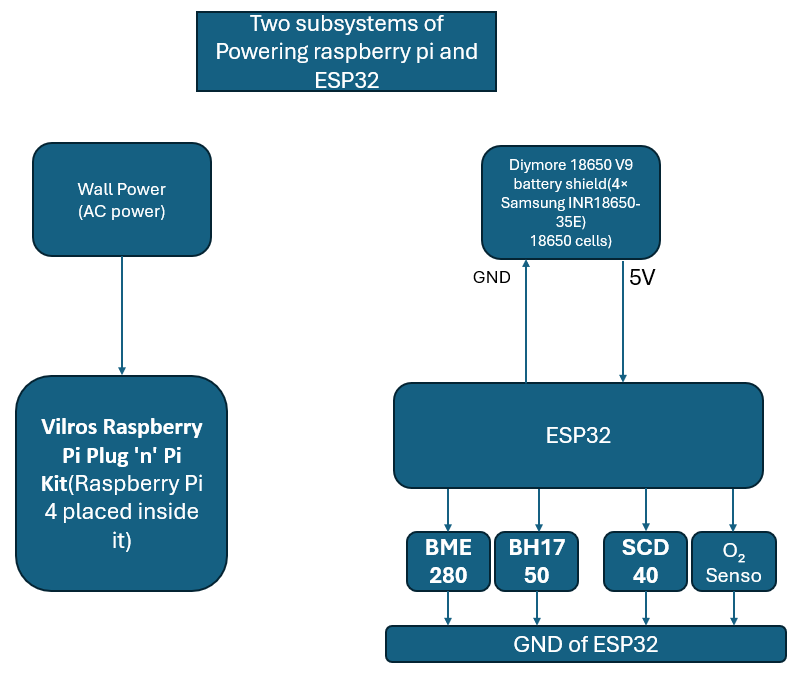

# Power Management Subsystem Design

**Prepared by:** Mohammed Almehmadi  
**Subsystem:** Power Management  
**Project:** Modular Greenhouse Monitoring System  
**Department of Electrical and Computer Engineering**  
**Tennessee Technological University**

---

## 1. Function of the Subsystem

The Power Management Subsystem ensures reliable, safe, and efficient electrical delivery to all modules of the greenhouse system — including three ESP32-based sensor units and one Raspberry Pi 4-based central processor.

This updated design uses:

- Diymore 18650 V9 battery shields with Samsung 30Q 3000mAh 18650 cells for ESP32 units.
- A Vilros Raspberry Pi Plug 'n' Pi power supply and case for direct wall-powered operation of the Raspberry Pi 4.

---

## 2. Specifications and Constraints

The power subsystem shall ensure reliable, regulated energy delivery to all modules of the greenhouse monitoring system — including ESP32-based sensor units and the central processing unit (Raspberry Pi 4). It shall support long-term off-grid operation, comply with electrical safety limits, and operate under indoor greenhouse environmental conditions.

1. **Electrical Safety Compliance**  
The power subsystem shall comply with OSHA 29 CFR 1910 Subpart S, which pertains to general electrical safety. All power connections shall be limited to a maximum voltage of 50V DC or less to ensure safe low-voltage operation. Electrical terminals shall be properly insulated, and all wiring shall be secured and rated to handle expected loads.

2. **Runtime Performance Compliance**  
The ESP32 modules and central processor shall be powered independently by battery systems. Each ESP32 unit shall operate for a minimum of 72 hours under normal sensing and transmission load. The Raspberry Pi 4 shall operate for a minimum of 72 hours under typical data processing and wireless communication tasks.

3. **Environmental Operation Compliance**  
The subsystem shall be designed to operate within indoor greenhouse environments, including high humidity and airborne dust. The temperature range for safe operation shall be between 0°C and 60°C. All enclosures and components shall be resistant to condensation, dust, and moderate thermal cycling.

4. **Current Supply Compliance**  
Each ESP32 module shall be supplied with a stable 5V regulated output to support sensor operation and wireless communication. The central processing unit shall receive a 5V power supply suitable for sustained processing and data transfer.

5. **Corrosion and Material Compliance**  
All wiring, fuses, and terminals shall meet ASTM B117 corrosion resistance standards to ensure durability in moist or chemically active greenhouse conditions. Terminals and cable jackets shall be chosen to prevent premature degradation in such environments.

---

## 3. Overview of Proposed Solution

Each ESP32 module is powered by a Diymore 18650 V9 battery shield fitted with four Samsung 30Q 3000mAh 18650 cells.  
The Diymore V9 shield includes an integrated boost converter that provides regulated 5V output, which is supplied directly to the ESP32’s Vin and GND pins.

The Raspberry Pi 4 is powered directly from wall power using the Vilros Raspberry Pi Plug 'n' Pi case and integrated power supply:

- Connects to a standard wall outlet (AC input).
- Outputs regulated 5V suitable for Raspberry Pi 4 operation.
- Includes case and cooling features for safe installation.

---

## 4. Interface with Other Subsystems

| Connected Subsystem         | Interface Type     | Direction | Description                                    |
|----------------------------|--------------------|-----------|------------------------------------------------|
| ESP32 Sensor Boards        | USB-A, USB-C   | Output    | 5V regulated output from Diymore 18650 V9 shield |
| Sensors (e.g., Gravity O₂) | Wired (VOUT, GND)  | Output    | 5V regulated supply through ESP32              |
| Raspberry Pi 4             | USB-C (Wall Plug)  | Output    | 5V from Vilros integrated power supply         |
| Battery Input (ESP32 side) | Wired (18650 Cells)| Input     | Samsung 30Q 3000mAh 18650 rechargeable cells   |

---

## 5. Block Diagram

---

## 6. Bill of Materials (BOM)

| Ref  | Component                              | Part Number      | Manufacturer    | Distributor         | Qty | Unit Price | Total     | URL                                                                 |
|------|----------------------------------------|------------------|-----------------|----------------------|-----|------------|-----------|----------------------------------------------------------------------|
| U1   | Diymore 18650 V9 Battery Shield        | -                | Diymore         | Amazon               | 3   | $16.99      | $50.97    | [Link](https://www.amazon.com/dp/B0CBMQ8PZH)                         |
| B1   | Samsung 30Q 18650 3000mAh Battery      | INR18650-30Q     | Samsung         | IMRbatteries         | 12  | $5.99      | $71.88    | [Link](https://imrbatteries.com/products/samsung-30q-18650-3000mah-15a-battery) |
| PWR1 | Vilros Raspberry Pi Plug 'n' Pi Kit    | B0CP1BZXTQ       | Vilros          | Amazon               | 1   | $14.99     | $14.99    | [Link](https://www.amazon.com/dp/B0CP1BZXTQ) 
| CBL1 | Baiwwa USB-A to USB-C Cable (3A, 1ft, 2-Pack)     | B0BBFP95GD   | Baiwwa       | Amazon      | 2   | $4.99      | $9.98  | [Link](https://www.amazon.com/Baiwwa-Charging-Braided-Charger-Compatible/dp/B0BBFP95GD?th=1)
                                                             

**Total BOM Cost (Updated System): ~$147.82**

---

## 7. Analysis

### 1. System Overview

The Modular Greenhouse Monitoring System uses two independent power sources:

- **Subsystem 1**: Raspberry Pi 4 powered by Vilros wall plug power supply.
- **Subsystem 2**: ESP32 sensor modules powered individually by Diymore 18650 V9 shields, each populated with four Samsung 30Q 18650 3000mAh cells.

---

**Raspberry Pi 4 Power Consumption**:

| Condition       | Current Draw | Power Consumption |
|-----------------|--------------|-------------------|
| Typical Load    | 600mA @ 5V   | 3.0W              |
| Peak Load       | 1.2A @ 5V    | 6.0W              |

(Reference: [12] Computer>> rasperi pi hardware >> power supply >> Typical power requirements table )

**Runtime Estimation**:
- Since the Raspberry Pi 4 is powered by **continuous wall power**, there is **no runtime limitation** due to battery capacity.
- The Vilros Plug 'n' Pi kit provides continuous, regulated 5V at up to 3A via USB-C, fully meeting the Raspberry Pi 4’s power requirements under both typical and peak load conditions.
- It simplifies system wiring by eliminating the need for external batteries, converters, or fuse management.
- The all-in-one case and power supply reduce installation complexity and increase system safety.
- Since the power comes from a reliable wall outlet, the Raspberry Pi 4 benefits from uninterrupted runtime and stable operation during data processing and wireless communication tasks.

**Conclusion**:  
The Vilros Plug 'n' Pi kit is a reliable and streamlined solution for powering the Raspberry Pi 4. It ensures sufficient current delivery, reduces design complexity, and supports continuous operation — making it the preferred choice for the final design and met the customer specifications.

### 2. ESP32 and Sensor Subsystem Power Analysis

**Power Source**:  
Diymore 18650 V9 Shield with four Samsung 30Q 3000mAh 18650 cells (connected internally and regulated to 5V output).

| Parameter | Value |
|:---|:---|
| Nominal battery voltage (each cell) | 3.6V |
| Battery capacity per cell | 3000mAh |
| Effective capacity (parallel config) | 12000mAh (12Ah) |
| Usable capacity (80% DOD) | 9.6Ah |
| Output voltage (regulated) | 5V |

**ESP32 and Sensor Load**:

| Component | Typical Current Draw | Peak Current Draw |
|:---|:---|:---|
| ESP32 (CPU active, Wi-Fi idle) | ~80mA | Required supply: ≥ 500mA |
| BH1750 Light Sensor | 120μA | - |
| BME280 (humidity + temp only) | 1.8μA | - |
| Gravity Oxygen (O₂) Sensor | ~100μA | - |
| SCD40 CO₂ Sensor | 15mA avg | 205mA peak |

**Total typical load**: ~95–110mA  
**Peak load**: ~250–300mA  
**Required supply capability**: ≥ 500mA

[Reference: [2] ESP32 Page 6]

[Reference: [4] BH1750 Page 2]

[Reference: [3] BME280 Page 9]

[Reference: [6] Gravity Oxygen (O₂)]

[Reference: [5] SCD40 CO₂]

  **Continuous Runtime Estimation**:
  
  - Power consumption (typical): 5V × 0.11A = **0.55W**
  - Usable battery energy: 3.6V × 9.6Ah = **34.56Wh**
  - Estimated runtime: 34.56Wh ÷ 0.55W ≈ **62.8 hours**
  
  **Energy Used per 5-Minute Cycle. 1 minute active phase and 4 minutes sleep phase**
  
  **Active phase (1 minute = 60 seconds):**  
  Power = 5V × 0.11A = **0.55 W**  
  Energy = 0.55 W × 60 s = **33 J**
  
  **Sleep phase (4 minutes = 240 seconds):**  
  Power = 5V × 0.00001A = **0.00005 W**  
  Energy = 0.00005 W × 240 s = **0.012 J**
  
  [Refrence[13], page 5]
  
  **Total energy per 5-minute cycle:**  
  33 J + 0.012 J = **33.012 J**
  
  Convert to Watt-hours:  
  33.012 J ÷ 3600 = **0.00917 Wh**
  
  ---
  
  ### Step 3: Estimate Total Runtime
  
  **Battery Setup per ESP32 Unit:**  
  4 × Samsung 30Q 3000mAh 18650 cells  
  → Raw energy = 4 × 3.6V × 3Ah = 43.2 Wh  
  → Usable energy (80% DoD × 90% boost efficiency):  
  43.2 Wh × 0.8 × 0.9 = **31.1 Wh**
  
  **Number of 5-minute cycles:**  
  31.1 Wh ÷ 0.00917 Wh/cycle ≈ **3392 cycles**
  
  ---
  
  ### Step 4: Convert Cycles to Hours
  
  Each cycle = 5 minutes  
  3392 cycles × 5 min = **16,960 minutes**  
  16,960 ÷ 60 = **~282.7 hours**
  
  ---
  
  ### Step 5: Final Runtime Estimation
  
  **Estimated runtime ≈ 283 hours**  
  (**~11.8 days**) when ESP32 is awake for 1 minute and asleep for 4 minutes in each 5-minute cycle.
  
  This runtime meets and far exceeds the required 72-hour threshold under your detailed design.
  
  **Conclusion**:
  
  - Runtime per ESP32 module exceeds 72 hours.
  - Power supply (5V 3A) from Diymore shield is sufficient.
  
  ---

### 3. Current Supply Check

| Subsystem         | Required Supply | Actual Peak Demand | Supply Provided         | Status     |
|------------------|------------------|---------------------|--------------------------|------------|
| Raspberry Pi 4    | ≥ 1.2A           | Up to 1.2A          | Vilros wall supply (5V)  | Sufficient |
| ESP32 + Sensors   | ≥ 500mA          | ~300mA              | Diymore V9 (5V/3A)       | Sufficient |

---

### 4. Overall Power System Conclusion

| Subsystem         | Power Source                     | Estimated Runtime            | Current Supply Analysis |
|------------------|----------------------------------|------------------------------|--------------------------|
| Raspberry Pi 4    | Vilros Plug 'n' Pi (Wall Power)  | Continuous                   | Sufficient               |
| ESP32 + Sensors   | 4× Samsung 30Q 18650 (each)      | >72 hours (w/ deep sleep)    | Sufficient               |

---

## 8. Equations Used

- **Battery Energy (Wh)** = Voltage (V) × Capacity (Ah)  
- **Corrected Usable Energy** = Energy × Efficiency  
- **Power Consumption (W)** = Voltage × Current  
- **Runtime (hrs)** = Usable Energy ÷ Power Consumption

---

## 9. References

[1] Raspberry Pi Foundation, "Raspberry Pi 4 Model B Datasheet," [Online]. Available: https://datasheets.raspberrypi.com/rpi4/raspberry-pi-4-datasheet.pdf

[2] Espressif Systems, "ESP32-WROOM-32 Datasheet," [Online]. Available: https://www.espressif.com/sites/default/files/documentation/esp32-wroom-32_datasheet_en.pdf

[3] Bosch Sensortec, "BME280 – Combined Humidity and Pressure Sensor Datasheet," [Online]. Available: https://www.bosch-sensortec.com/media/boschsensortec/downloads/datasheets/bst-bme280-ds002.pdf

[4] “Digital 16bit Serial Output Type Ambient Light Sensor IC BH1750FVI.” Available: https://www.mouser.com/datasheet/2/348/bh1750fvi-e-186247.pdf ‌

[5] Sensirion AG, “SCD40 - Compact & cost-effective photoacoustic NDIR CO2 sensor,” Sensirion.com, 2024. https://sensirion.com/products/catalog/SCD40 ‌

[6] DFRobot, "Gravity Electrochemical Oxygen Sensor (0–25% Vol) Datasheet," [Online]. Available: https://www.dfrobot.com/product-2052.html?srsltid=AfmBOorSAyVzRlXAK_eZcoe1fjlFbqMoD4c2uKpNF5Vo8n08V-KDZj13

[7] Diymore Store, "18650 Battery Shield V8 Module for Arduino/Raspberry Pi Product Page," [Online]. Available: https://www.amazon.com/Diymore-Lithium-Battery-Charging-Arduino/dp/B07SZKNST4

[8] Texas Instruments, "MT3608 DC-DC Boost Converter Datasheet," [Online]. Available: https://www.ti.com/lit/ds/symlink/mt3608.pdf

[9] Occupational Safety and Health Administration (OSHA), "Standard 29 CFR 1910.303 – General Requirements," OSHA Regulations, [Online]. Available: https://www.osha.gov/laws-regs/regulations/standardnumber/1910/1910.303

[10] M. Rentschler, "Recommendation of Diymore 18650 Battery Shield V8 for portable Raspberry Pi and ESP32 applications," Personal communication, Apr. 2025. [Online]. Available: https://www.amazon.com/Diymore-Lithium-Battery-Charging-Arduino/dp/B07SZKNST4

[11] ChatGPT. (2025). AI-based text refinement for improved structure, readability, and formatting. OpenAI

[12] Typical Power Requirements,  Raspberry Pi Documentation Power Supply. [Online]. Available: https://www.raspberrypi.com/documentation/computers/raspberry-pi.html#power-supply
[13] Espressif Systems, *ESP32 Series Datasheet, Version 4.9*, Espressif Systems, Apr. 2024. [Online]. Available: https://www.espressif.com/sites/default/files/documentation/esp32_datasheet_en.pdf

