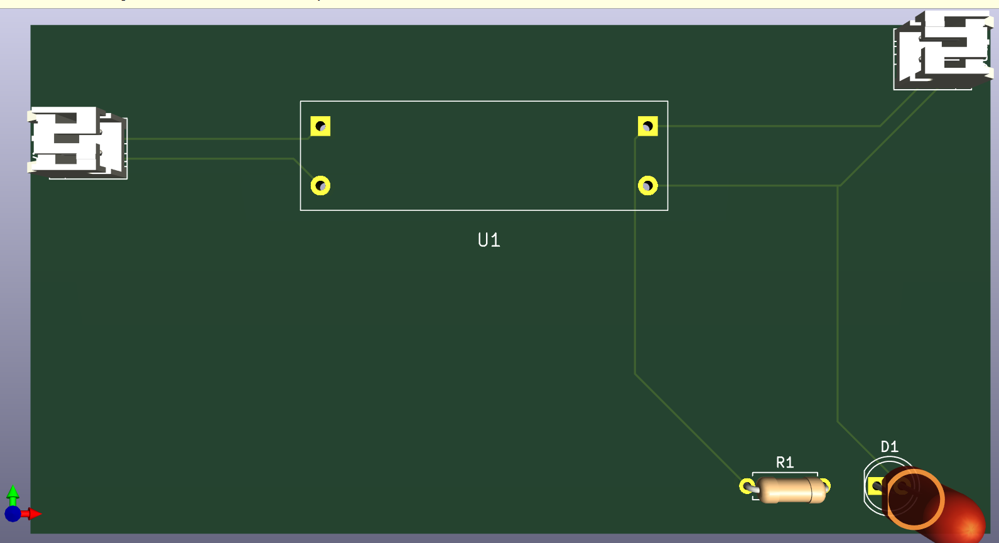
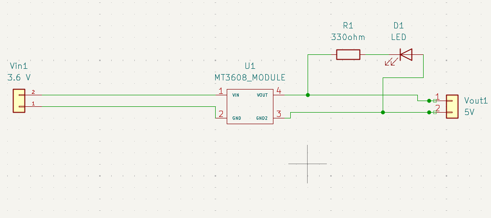
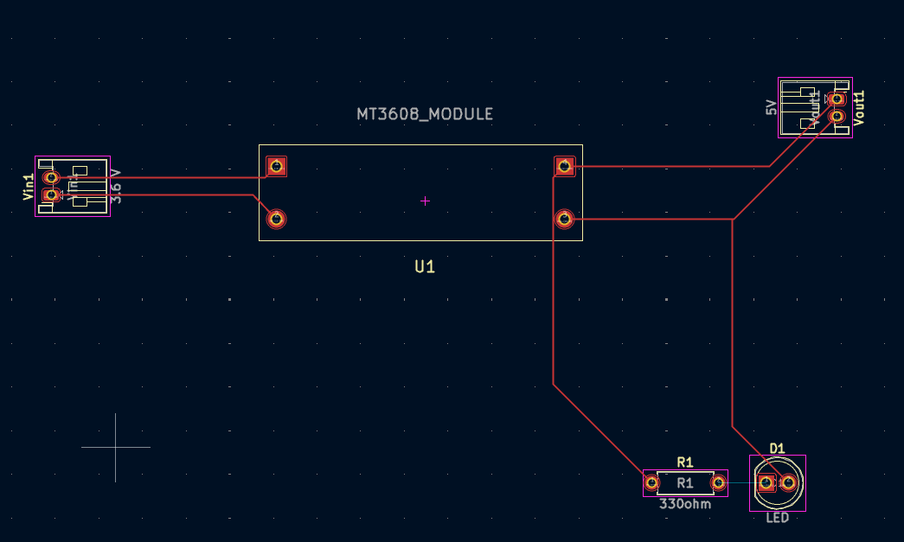

**Power Management Subsystem Design Document**

**Prepared by:** Mohammed Almehmadi  
**Subsystem:** Power Management  
**Project:** Modular Greenhouse Monitoring System  
**Department of Electrical and Computer Engineering**  
**Tennessee Technological University**

---

### 1. Function of the Subsystem

The Power Management Subsystem is responsible fordelivering consistent, safe, and efficient electrical power to all components of the greenhouse monitoring system. It powers three ESP32-based sensor modules and one Raspberry Pi-based central unit. The subsystem ensures uninterrupted performance through off-grid power sources (battery packs) and voltage regulation using boost converters. It directly supports portability, modularity, and power isolation required in field deployments.

---

### 2. Specifications and Constraints

#### Specifications
1. The subsystem shall provide regulated output voltages of 3.3V or 5V, depending on device requirements.
2. Each sensor module shall be powered by a 3-cell Eneloop Pro AA NiMH battery pack, delivering 3.6V nominal.
3. Each sensor module shall include an MT3608 boost converter to raise voltage to 5V.
4. The boost converter shall operate with an efficiency greater than 80%.
5. The system shall operate continuously for a minimum of 72 hours per charge cycle.
6. The output voltage of the MT3608 shall be measured using a multimeter and adjusted via the onboard potentiometer before deployment.
7. The Raspberry Pi shall be powered by a USB power bank providing 5V at 3A.

#### Constraints
1. The subsystem shall not exceed 50V DC to comply with OSHA Standard 29 CFR 1910.303.
2. Power components shall operate safely within a temperature range of 0°C to 60°C.
3. Materials shall comply with ASTM B117 for corrosion resistance.
4. Cost per sensor module (power components only) shall not exceed $25.

---

### 3. Overview of Proposed Solution

Each sensor module is powered by a 3-cell battery pack connected to an MT3608 boost converter. The MT3608 raises the battery voltage (~3.6V) to 5V, supplying the ESP32 and any 5V-specific sensors such as the Gravity O₂ sensor. A multimeter is used to adjust the output voltage via the onboard potentiometer prior to integration. The central Raspberry Pi unit is powered by a high-capacity 5V USB power bank. Wiring is done using JST or screw terminals to ensure modularity and portability.

---

### 4. Interface with Other Subsystems

| Connected Subsystem | Interface Type | Direction | Description |
|---------------------|----------------|-----------|-------------|
| ESP32 Sensor Boards | Wired (Vin, GND) | Output | Regulated 5V from MT3608 to ESP32 Vin pin |
| Sensors (e.g., Gravity O₂) | Wired (VOUT, GND) | Output | Direct 5V power to sensor from MT3608 |
| Raspberry Pi | USB-C | Output | 5V from power bank to Raspberry Pi power input |

All grounds are shared, forming a common electrical reference across all modules and devices.

---

###5. 3D Model

###6. Buildable Schematic

###7. Printed Circuit Board Layout

### 8. Bill of Materials (BOM)

| Ref | Component                  | Part Number    | Manufacturer | Distributor | Qty | Price     | URL |
|-----|----------------------------|----------------|--------------|-------------|-----|-----------|-----|
| U1  | MT3608 Boost Converter    | MT3608         | AITRIP       | Amazon      | 3   | $5.99 (5pk)| [Link](https://www.amazon.com/dp/B0C858YYQ1) |
| B1  | Eneloop Pro AA Battery     | BK-3HCCA8BA    | Panasonic    | Amazon      | 9   | $36.45 (8pk)| [Link](https://www.amazon.com/dp/B00MXCIK32) |
| H1  | AA Battery Holder (3-slot) | BH3AAW          | Elenco       | Digikey     | 3   | $1.5   | [Link](https://www.digikey.com) |
| D1  | LED (3mm Red)             | LTL-307EE      | Lite-On      | Digikey     | 3   | $0.50     | [Link](https://www.digikey.com) |
| R1  | Resistor 330Ω             | CF14JT330R     | Stackpole    | Mouser      | 3   | $0.05     | [Link](https://www.mouser.com) |
| P1  | JST Connector Pair         | B2B-PH-K-S     | JST          | Digikey     | 12   | $0.30     | [Link](https://www.digikey.com) |
| PWR | USB-C Power Bank (20,000mAh, PD) | PowerCore Essential 20000 PD (B07SQ5MQ6K)| Anker        | Amazon      | 1   | $54.99| [Link] https://www.amazon.com/dp/B07SQ5MQ6K

---

### 9. Analysis

##Analysis
The MT3608 boost converter is highly compatible with low-voltage battery sources, delivering regulated 5V output from a 3.6V nominal Eneloop Pro pack. With up to 1.2A output capability, it reliably powers both the ESP32 microcontroller and a 5V sensor such as the Gravity O₂ sensor under standard operating loads. The output voltage is calibrated using a multimeter via the onboard potentiometer before integration to ensure stable 5V delivery.
Each sensor unit is mounted on a dedicated custom-designed printed circuit board (PCB) to minimize wiring complexity, reduce noise, and ensure consistent mechanical layout. This PCB integrates battery input, MT3608 boost conversion, output distribution, an onboard LED indicator with a current-limiting resistor, and modular JST connectors. One PCB is required per sensor module, enabling scalable and uniform deployment across multiple greenhouse units. Modular JST connectors improve wiring reliability and 
The power system is evaluated based on the expected current draw of the ESP32 and the Gravity O₂ sensor.

ESP32 average draw: ~100 mA (Wi-Fi enabled, periodic transmission)
O₂ sensor draw: ~10 mA
Combined draw: ~110–130 mA
Battery pack: 3 × Eneloop Pro AA (3.6V nominal, 2550 mAh total)
Boost converter efficiency: ~85%

Estimated runtime:
Runtime = (3.6V × 2.55Ah) ÷ ((0.13A × 5V) / 0.85) ≈ 70 hours

This meets the 72-hour minimum operational target per charge cycle.
The Raspberry Pi 4 is powered by an Anker PowerCore Essential 20000 mAh USB-C power bank.
Assumed draw: ~600 mA average (including camera and Wi-Fi activity)

Estimated runtime: 20000 mAh ÷ 600 mA ≈ 33 hours

Although the baseline system meets the runtime goal, further improvements are under investigation. Software-based power optimization strategies are being considered to extend ESP32 battery life beyond 72 hours. The following techniques are under evaluation:
- Deep Sleep Mode: ESP32 enters ultra-low power mode between sensor sampling intervals
- Duty Cycling: Sensors are powered only during active data acquisition windows
- RTC Wakeups: Timer-based activation of the ESP32 minimizes idle current
- Data Batching: Transmitting sensor data in bursts reduces radio use

These techniques are expected to reduce the average current consumption of each sensor module, extending runtime. Final implementation will be determined based on trade-offs between data granularity and system longevity.
The design adheres to all specified standards:
- OSHA 29 CFR 1910.303: Maximum voltage remains below 50V DC
- ASTM B117: Materials and connectors meet corrosion resistance for humid greenhouse environments
- Cost per power module (including PCB, boost converter, battery holder, LED, and connectors) remains below $15, which satisfies the $25 subsystem cost limit.

---

### 10. References

[1] Occupational Safety and Health Administration (OSHA), "Standard 29 CFR 1910.303 – General Requirements," OSHA Regulations, [Online]. Available: https://www.osha.gov/laws-regs/regulations/standardnumber/1910/1910.303

[2] Panasonic Corporation, Eneloop Pro AA Battery Datasheet. [Online]. Available: https://www.panasonic.com/global/consumer/batteries/eneloop.html

[3] Amazon, "MT3608 Boost Converter Module," Amazon.com, [Online]. Available: https://www.amazon.com/dp/B0C858YYQ1

[4] Espressif Systems, ESP-WROOM-32 Datasheet, 2020. [Online]. Available: https://www.espressif.com/sites/default/files/documentation/esp-wroom-32

[5] Olimex Ltd., MT3608 Step-Up Converter Module Datasheet. [Online]. Available: https://www.olimex.com/Products/Breadboarding/BB-PWR-3608/resources/MT3608.pdf

[6] ChatGPT. (2025). AI-based text refinement for improved structure, readability, and formatting. OpenAI.
