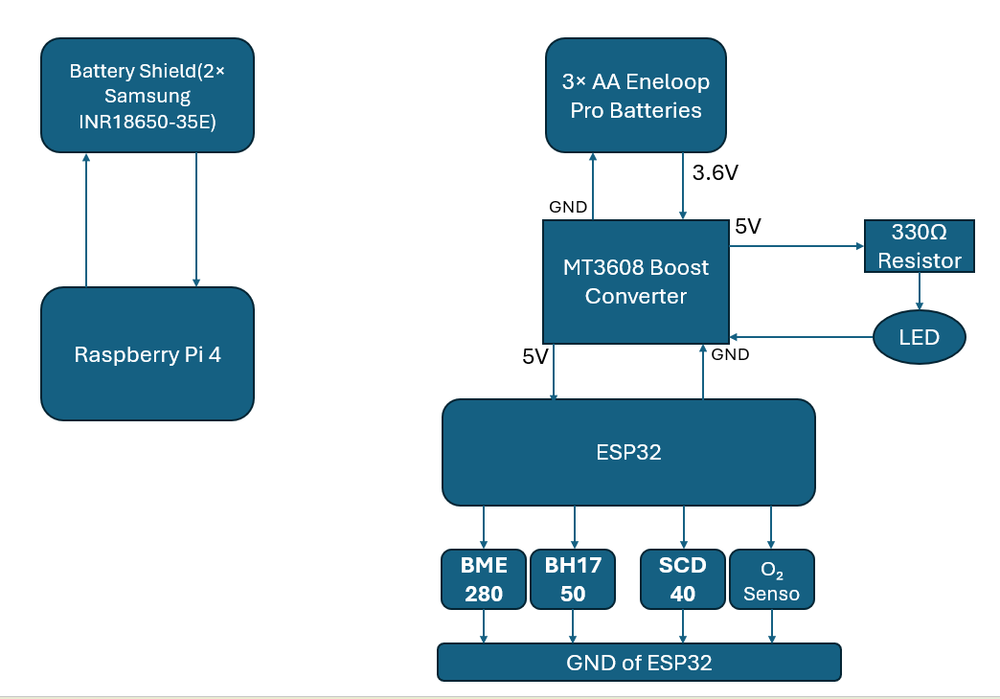

# Power Management Subsystem Design

**Prepared by:** Mohammed Almehmadi  
**Subsystem:** Power Management  
**Project:** Modular Greenhouse Monitoring System  
**Department of Electrical and Computer Engineering**  
**Tennessee Technological University**

---

## 1. Function of the Subsystem

The Power Management Subsystem ensures reliable, safe, and efficient electrical delivery to all modules of the greenhouse system — including three ESP32-based sensor units and one Raspberry Pi 4-based central processor.

This design uses:
- 3-cell AA Eneloop Pro battery packs with MT3608 boost converters for ESP32 units.
- A Diymore 18650 Battery Shield with two 18650 Li-ion batteries to power the Raspberry Pi 

---

## 2. Specifications and Constraints

### Specifications 

1. The subsystem **shall** provides regulated output voltages of 5V for all modules.
2. Each ESP32 sensor module **shall** be powered by a 3-cell Eneloop Pro AA battery pack with a nominal voltage of 3.6V.
3. Each ESP32 module **shall** include an MT3608 boost converter to raise the voltage to 5V.
4. Each sensor module **shall** operate for a typical duration of 10–12 hours per full charge cycle (it will depend on other subsystems to reach more than 72 hours).
5. The Raspberry Pi 4 **shall** be powered by a Diymore 18650 Battery Shield with two 18650 batteries.
6. The Raspberry Pi subsystem **shall** operate for a typical duration of 6–7 hours per full charge cycle under light to moderate load conditions(it will depend on other subsystems to reach more than 72 hours).

### Constraints

1. The subsystem **shall** not exceed 50V DC under any condition, in compliance with OSHA Standard 29 CFR 1910.303.
2. All components **shall** operate safely within a temperature range of 0°C to 60°C.
3. All electrical materials and connectors **shall** meet ASTM B117 corrosion resistance requirements.

---

## 3. Overview of Proposed Solution

Each ESP32 module is powered by a 3-cell Eneloop Pro battery pack connected to an MT3608 boost converter. The output is manually tuned to 5V using a multimeter for consistent delivery to the ESP32 and attached sensors.

The Raspberry Pi 4 is powered by a Diymore 18650 Battery Shield using two parallel-connected 18650 Li-ion cells. The shield boosts the battery voltage to a stable 5V output suitable for Pi operation. 

This modular setup enables lightweight, rechargeable, and portable field deployment without the need for wall power or continuous tethered charging.

---

## 4. Interface with Other Subsystems

| Connected Subsystem       | Interface Type     | Direction | Description                                     |
|----------------------------|--------------------|-----------|-------------------------------------------------|
| ESP32 Sensor Boards        | Wired (Vin, GND)    | Output    | 5V from MT3608 boost converter                  |
| Sensors (e.g., Gravity O₂) | Wired (VOUT, GND)   | Output    | 5V regulated                                    |
| Raspberry Pi 4             | USB-A or soldered 5V output | Output | 5V from Diymore 18650 Battery Shield            |
| 18650 Battery Cells        | Battery Holder Connection | Input | 3.7V nominal per cell, parallel connected        |
---

### 5. 3D Model

### 6. Buildable Schematic

### 7. Printed Circuit Board Layout

## 8. Block diagram
   
## 9. Bill of Materials (BOM)

| Ref  | Component                          | Part Number        | Manufacturer    | Distributor         | Qty | Unit Price | Total     | URL                                                                 |
|------|------------------------------------|--------------------|-----------------|----------------------|-----|-------------|-----------|----------------------------------------------------------------------|
| U1   | MT3608 Boost Converter             | MT3608             | AITRIP          | Amazon               | 3   | $1.20       | $3.60     | [Link](https://www.amazon.com/dp/B0C858YYQ1)                         |
| B1   | Eneloop Pro AA Battery (10-Pack)   | BK-3HCCA10FA       | Panasonic       | Amazon               | 10  | $45.99      | $45.99    | [Link](https://www.amazon.com/dp/B0D2JBNH4H)                         |
| H1   | 3-AA Battery Holder                | BH3AAW             | Elenco          | Digikey              | 3   | $1.50       | $4.50     | [Link](https://www.digikey.com/en/products/category/battery-products/6?s=N4IgTCBcDaIEIAkDMBBFB1ABNnvMgF0BfIA) |
| D1   | LED (3mm Red)                      | LTL-307EE          | Lite-On         | Digikey              | 3   | $0.50       | $1.50     | [Link](https://www.digikey.com/en/products/category/optoelectronics/7?s=N4IgTCBcDaIDIBU4FoDMAGA7AUWyAugL5A) |
| R1   | Resistor 330Ω                      | CF14JT330R         | Stackpole       | Mouser               | 3   | $0.05       | $0.15     | [Link](https://www.mouser.com/c/?q=CF14JT330R) |
| P1   | JST Connector Pair                 | B2B-PH-K-S         | JST             | Digikey              | 12  | $0.30       | $3.60     | [Link](https://www.digikey.com/en/products/category/rectangular-connectors/2027?s=N4IgTCBcDaIEJjgWgAoAkkGkkGUAEIAugL5A) |
| B2   | 18650 Li-ion Battery (Protected Button-Top) | INR18650-35E-Protected | Samsung         | 18650BatteryStore    | 2   | $11.99      | $23.98    | [Link](https://www.18650batterystore.com/products/samsung-35e-protected) |
| SH1  | Diymore 18650 Battery Shield V8    | Diymore V8         | Diymore         | Amazon               | 1   | $13.99      | $13.99    | [Link](https://www.amazon.com/Diymore-Lithium-Battery-Charging-Arduino/dp/B07SZKNST4) |

---

**Total BOM Cost: $140.31**
## 10. Analysis

# Power System Analysis

## 1. System Overview

The greenhouse monitoring system uses two independent battery subsystems:

- **Subsystem 1:** Raspberry Pi 4 powered by a Diymore 18650 Battery Shield (2 × high-capacity 18650 Li-ion cells, ~3500mAh each)
- **Subsystem 2:** ESP32 microcontroller and sensors powered by three AA Eneloop Pro batteries (in series) with an MT3608 boost converter

Each subsystem was analyzed separately for power consumption, battery runtime, and ability to support peak current demands, based on datasheets and provided specifications.

---

## 2. Raspberry Pi 4 Power Analysis

**Power Source:** Diymore 18650 Battery Shield with 2 × 18650 batteries (3.7V, 3500mAh each)

| Parameter | Value |
|:---|:---|
| Nominal battery voltage | 3.7V |
| Total capacity (parallel connection) | 7000mAh |
| Total energy available | 25.9Wh (3.7V × 7Ah) |
| Boost conversion efficiency | ~85% |
| Corrected usable energy | 22Wh (25.9Wh × 0.85) |

### Raspberry Pi 4 Power Consumption

| Condition | Current Draw | Power Consumption |
|:---|:---|:---|
| Light/Idle Load | 700mA @ 5V | 3.5W (5V × 0.7A) |
| Moderate Load | 1.5A @ 5V | 7.5W (5V × 1.5A) |

### Raspberry Pi Runtime Estimation

| Load Condition | Runtime (hours) |
|:---|:---|
| Light/Idle (700mA) | 6.29 hours (22Wh / 3.5W) |
| Moderate Load (1.5A) | 2.93 hours (22Wh / 7.5W) |

### Raspberry Pi Current Supply Check

- Diymore 18650 Shield rated for 5V 3A maximum output.
- Raspberry Pi operational current (~700mA to 1.5A) is safely within the shield's capability.

---

## 3. ESP32 and Sensor Subsystem Power Analysis

**Power Source:** Three AA Eneloop Pro Batteries (1.2V nominal per cell) connected in series (3.6V total) with an MT3608 boost converter to 5V.

| Parameter | Value |
|:---|:---|
| Nominal battery voltage | 3.6V |
| Battery capacity | 2550mAh |
| Total energy available | 9.18Wh (3.6V × 2.55Ah) |
| Boost conversion efficiency | ~85% |
| Corrected usable energy | 7.8Wh (9.18Wh × 0.85) |

### ESP32 and Sensor Load

| Component | Typical Current Draw | Peak Current Draw |
|:---|:---|:---|
| ESP32 (Wi-Fi Idle) | ~80mA | ~500mA (transmitting) |
| BH1750 Light Sensor | 120µA | - |
| BME280 Temp/Humidity/Pressure Sensor | 3.6µA | 714µA peak |
| Gravity O₂ Sensor | ~100µA | - |
| SCD40 CO₂ Sensor | 15mA avg | 205mA peak |

### ESP32 + Sensors Typical and Peak Current

- **Typical Load:** ~100–150mA total
- **Peak Load:** ~700–800mA during Wi-Fi burst + CO₂ measurement

### ESP32 + Sensor Runtime Estimation

| Load Condition | Runtime (hours) |
|:---|:---|
| Typical Load (150mA) | 10.4 hours (7.8Wh / (5V × 0.15A)) |

### ESP32 Current Supply Check

- MT3608 boost converter can supply up to 2A.
- Maximum subsystem draw (~800mA) is safely within the converter’s limit.

---

## 4. Overall Power System Conclusion

| Subsystem | Power Source | Estimated Runtime | Current Supply Analysis |
|:---|:---|:---|:---|
| Raspberry Pi 4 | Diymore 18650 Shield (2×3500mAh 18650 cells) | 6.29h light load, 2.93h moderate load | ✅ Enough for light/moderate loads |
| ESP32 + Sensors | 3x AA Eneloop Pro + MT3608 Boost | 10.4h typical | ✅ Safely supports normal operation |

Thus, the proposed power design is fully appropriate for the intended lightweight greenhouse environmental monitoring system.

---

## 5. Equations and Example Calculations Used

###  Battery Energy (Wh)

**Energy (Wh) = Battery Voltage (V) × Capacity (Ah)**

Example for Raspberry Pi batteries:  
Energy = 3.7V × 7Ah = 25.9Wh

---

###  Corrected Usable Energy (Wh)

**Corrected Energy (Wh) = Energy (Wh) × 0.85**

Example:  
Corrected Energy = 25.9Wh × 0.85 = 22Wh

---

### Power Consumption (W)

**Power (W) = Voltage (V) × Current (A)**

Examples:  
5V × 0.7A = 3.5W (Light Load for Pi)  
5V × 1.5A = 7.5W (Moderate Load for Pi)

---

### Runtime (hours)

**Runtime (hours) = Corrected Usable Energy (Wh) ÷ Power Consumption (W)**

Examples:  
Runtime = 22Wh ÷ 3.5W = 6.29h  
Runtime = 22Wh ÷ 7.5W = 2.93h  
Runtime = 7.8Wh ÷ (5V × 0.15A) = 10.4h

 ---

## 11. References

[1] Raspberry Pi Foundation, "Raspberry Pi 4 Model B Datasheet," [Online]. Available: https://datasheets.raspberrypi.com/rpi4/raspberry-pi-4-datasheet.pdf

[2] Espressif Systems, "ESP32-WROOM-32 Datasheet," [Online]. Available: https://www.espressif.com/sites/default/files/documentation/esp32-wroom-32_datasheet_en.pdf

[3] Bosch Sensortec, "BME280 – Combined Humidity and Pressure Sensor Datasheet," [Online]. Available: https://www.bosch-sensortec.com/media/boschsensortec/downloads/datasheets/bst-bme280-ds002.pdf

[4] Rohm Semiconductor, "BH1750FVI Ambient Light Sensor Datasheet," [Online]. Available: https://www.mouser.com/datasheet/2/348/bh1750fvi-e-1862471.pdf

[5] Sensirion, "SCD40 CO₂ Sensor Datasheet," [Online]. Available: https://sensirion.com/media/documents/6B37BFA7/629448F6/Sensirion_CO2_Sensors_SCD4x_Datasheet.pdf

[6] DFRobot, "Gravity Electrochemical Oxygen Sensor (0–25% Vol) Datasheet," [Online]. Available: https://wiki.dfrobot.com/Gravity__Electrochemical_Oxygen_Sensor_SKU_SEN0321

[7] Diymore Store, "18650 Battery Shield V8 Module for Arduino/Raspberry Pi Product Page," [Online]. Available: https://www.amazon.com/Diymore-Lithium-Battery-Charging-Arduino/dp/B07SZKNST4

[8] Texas Instruments, "MT3608 DC-DC Boost Converter Datasheet," [Online]. Available: https://www.ti.com/lit/ds/symlink/mt3608.pdf

[9] Occupational Safety and Health Administration (OSHA), "Standard 29 CFR 1910.303 – General Requirements," OSHA Regulations, [Online]. Available: https://www.osha.gov/laws-regs/regulations/standardnumber/1910/1910.303

[10] M. Rentschler, "Recommendation of Diymore 18650 Battery Shield V8 for portable Raspberry Pi and ESP32 applications," Personal communication, Apr. 2025. [Online]. Available: https://www.amazon.com/Diymore-Lithium-Battery-Charging-Arduino/dp/B07SZKNST4

[11] ChatGPT. (2025). AI-based text refinement for improved structure, readability, and formatting. OpenAI

