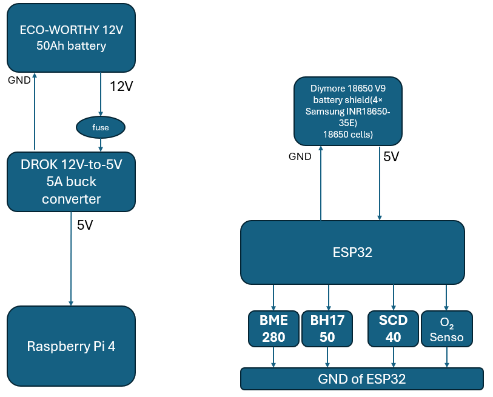

# Power Management Subsystem Design

**Prepared by:** Mohammed Almehmadi  
**Subsystem:** Power Management  
**Project:** Modular Greenhouse Monitoring System  
**Department of Electrical and Computer Engineering**  
**Tennessee Technological University**

---

## 1. Function of the Subsystem

The Power Management Subsystem ensures reliable, safe, and efficient electrical delivery to all modules of the greenhouse system — including three ESP32-based sensor units and one Raspberry Pi 4-based central processor.

This updated design uses:

- Diymore 18650 V9 battery shields with Samsung 30Q 3000mAh 18650 cells for ESP32 units.
- An ECO-WORTHY 12V 50Ah LiFePO₄ battery connected to a DROK 12V-to-5V 5A buck converter (USB output) to power the Raspberry Pi 4.

---

## 2. Specifications and Constraints

The power subsystem shall ensure reliable, regulated energy delivery to all modules of the greenhouse monitoring system — including ESP32-based sensor units and the central processing unit (Raspberry Pi 4). It shall support long-term off-grid operation, comply with electrical safety limits, and operate under indoor greenhouse environmental conditions.

1. Electrical Safety Compliance
The power subsystem shall comply with OSHA 29 CFR 1910 Subpart S, which pertains to general electrical safety. All power connections shall be limited to a maximum voltage of 50V DC or less to ensure safe low-voltage operation. Electrical terminals shall be properly insulated, and all wiring shall be secured and rated to handle expected loads.

2. Runtime Performance Compliance
The ESP32 modules and central processor shall be powered independently by battery systems. Each ESP32 unit shall operate for a minimum of 72 hours under normal sensing and transmission load. The Raspberry Pi 4 shall operate for a minimum of 72 hours under typical data processing and wireless communication tasks.

3. Environmental Operation Compliance
The subsystem shall be designed to operate within indoor greenhouse environments, including high humidity and airborne dust. The temperature range for safe operation shall be between 0°C and 60°C. All enclosures and components shall be resistant to condensation, dust, and moderate thermal cycling.

4. Current Supply Compliance
Each ESP32 module shall be supplied with a stable 5V regulated output to support sensor operation and wireless communication. The central processing unit shall receive a 5V power supply suitable for sustained processing and data transfer. 

5. Corrosion and Material Compliance
All wiring, fuses, and terminals shall meet ASTM B117 corrosion resistance standards to ensure durability in moist or chemically active greenhouse conditions. Terminals and cable jackets shall be chosen to prevent premature degradation in such environments.

---

## 3. Overview of Proposed Solution

Each ESP32 module is powered by a Diymore 18650 V9 battery shield fitted with four Samsung 30Q 3000mAh 18650 cells.  
The Diymore V9 shield includes an integrated boost converter that provides regulated 5V output, which is supplied directly to the ESP32’s Vin and GND pins.

The Raspberry Pi 4 is powered by an ECO-WORTHY 12V 50Ah battery through a DROK buck converter that:

- Receives 12V input directly from the battery terminals.
- Outputs regulated 5V via a USB-A port.
- Connects to the Raspberry Pi 4 via a short USB-A to USB-C cable.

---

## 4. Interface with Other Subsystems

| Connected Subsystem         | Interface Type     | Direction | Description                                    |
|------------------------------|--------------------|-----------|------------------------------------------------|
| ESP32 Sensor Boards          | Wired (Vin, GND)    | Output    | 5V regulated output from Diymore 18650 V9 shield |
| Sensors (e.g., Gravity O₂)   | Wired (VOUT, GND)   | Output    | 5V regulated supply through ESP32              |
| Raspberry Pi 4               | USB-C (via USB-A)   | Output    | 5V from DROK buck converter                    |
| Battery Input (ESP32 side)   | Wired (18650 Cells) | Input     | Samsung 30Q 3000mAh 18650 rechargeable cells   |
| Battery Input (Raspberry Pi) | Wired (12V DC)      | Input     | 12V from ECO-WORTHY LiFePO₄ battery           |

---
## 5 Block Diagram

---

## 6 Bill of Materials (BOM)

| Ref  | Component                              | Part Number      | Manufacturer    | Distributor         | Qty | Unit Price | Total     | URL                                                                 |
|------|----------------------------------------|------------------|-----------------|----------------------|-----|------------|-----------|----------------------------------------------------------------------|
| U1   | Diymore 18650 V9 Battery Shield        |       -         | Diymore         | Amazon               | 3   | $6.99      | $20.97    | [Link](https://www.amazon.com/dp/B0CBMQ8PZH)                         |
| B1   | Samsung 30Q 18650 3000mAh Battery      | INR18650-30Q     | Samsung         | IMRbatteries         | 12  | $5.99      | $71.88    | [Link](https://imrbatteries.com/products/samsung-30q-18650-3000mah-15a-battery) |
| PWR1 | ECO-WORTHY 12V 50Ah LiFePO₄ Battery     | US-L13080202015-1                | ECO-WORTHY      | Amazon               | 1   | $127.99    | $127.99   | [Link](https://www.amazon.com/ECO-WORTHY-50Ah-Trolling-Rechargeable-Phosphate/dp/B0C49STP5P?th=1)                         |
| PWR2 | DROK Buck Converter 12V to 5V, 5A USB   | B01NALDSJ0       | DROK            | Amazon               | 1   | $9.99      | $9.99     | [Link](https://www.amazon.com/dp/B01NALDSJ0)                         |
| CBL1 | Baiwwa Short USB Type C Cable (USB-A to USB-C, 3A Rated, 1ft, 2-Pack) | B0BBFP95GD | Baiwwa | Amazon | 1 | $4.99 | $4.99 | [Link](https://www.amazon.com/Baiwwa-Charging-Braided-Charger-Compatible/dp/B0BBFP95GD/ref=asc_df_B0BBFP95GD?mcid=4dddfc575332313ba7705f1e74c3b3cf&hvocijid=4133860197123646353-B0BBFP95GD-&hvexpln=73&tag=hyprod-20&linkCode=df0&hvadid=721245378154&hvpos=&hvnetw=g&hvrand=4133860197123646353&hvpone=&hvptwo=&hvqmt=&hvdev=c&hvdvcmdl=&hvlocint=&hvlocphy=1025954&hvtargid=pla-2281435177418&th=1) |
| CN1  | Ring Terminal, 5/16 Stud, 10-12 AWG    | 31123            | TE Connectivity AMP Connectors | DigiKey    | 4   | $0.27      | $1.08     | [Link](https://www.digikey.com/en/products/detail/te-connectivity-amp-connectors/31123/333510) |
| F1   | MCIGICM 12 AWG Inline Fuse Holder with 30A Blade Fuse (5 Pack) | B081DHT8Y7 | MCIGICM | Amazon | 1 | $7.99 | $7.99 | [Link](https://www.amazon.com/dp/B081DHT8Y7) |
| F2   | Eaton Bussmann Series ATC 10A Blade Fuse (5 Pack) | ATC10 | Bussmann | Amazon | 1 | $4.61 | $4.61 | [Link](https://www.amazon.com/Bussmann-ATC10-Blade-Fuse/dp/B00139IRK2) |
| W1   | BNTECHGO 12 Gauge Silicone Wire 3ft Red and 3ft Black | - | BNTECHGO | Amazon | 1 | $7.98 | $7.98 | [Link](https://www.amazon.com/BNTECHGO-Silicone-Flexible-Strands-Stranded/dp/B01AQU3ST8) |

---

**Total BOM Cost (Updated System): ~$285**

# 7. Analysis
**Power System Analysis**

---

## 1. System Overview

The Modular Greenhouse Monitoring System uses two independent battery subsystems:

- **Subsystem 1**: Raspberry Pi 4 powered by an ECO-WORTHY 12V 50Ah LiFePO₄ battery connected through a DROK 12V-to-5V 5A buck converter.
- **Subsystem 2**: ESP32 sensor modules powered individually by Diymore 18650 V9 shields, each populated with four Samsung 30Q 18650 3000mAh cells.

---

## 2. Raspberry Pi 4 Power Analysis

**Power Source**: ECO-WORTHY 12V 50Ah LiFePO₄ Battery

| Parameter | Value |
|:---|:---|
| Nominal battery voltage | 12V |
| Total battery capacity | 50Ah |
| Usable battery capacity (80% DOD) | 40Ah |
| Buck converter efficiency | 90% |

**Available Energy**:

Battery Energy (Wh) = Battery Voltage (V) × Usable Capacity (Ah)  
Battery Energy = 12V × 40Ah = **480Wh**

**Raspberry Pi 4 Power Consumption**:

| Condition | Current Draw | Power Consumption |
|:---|:---|:---|
| Typical Load | 600mA @ 5V | 3.0W |
| Peak Load | 1.2A @ 5V | 6.0W |
(Reference: [12] Computer>> rasperi pi hardware >> power supply >> Typical power requirements table )

**Runtime Estimation**:

- For **typical load** (3.0W):  
Runtime = 480Wh ÷ 3.0W = **160 hours**

- For **peak load** (6.0W):  
Runtime = 480Wh ÷ 6.0W = **80 hours**

**Conclusion**:  
The Raspberry Pi 4 can operate for approximately **160 hours** at typical usage and **80 hours** under full load. The ECO-WORTHY 50Ah 12V battery with a DROK buck converter safely supports both conditions.

---

## 3. ESP32 and Sensor Subsystem Power Analysis

**Power Source**:  
Diymore 18650 V9 Shield with four Samsung 30Q 3000mAh 18650 cells (connected internally and regulated to 5V output).

| Parameter | Value |
|:---|:---|
| Nominal battery voltage (each cell) | 3.6V |
| Battery capacity per cell | 3000mAh |
| Effective capacity (parallel config) | 12000mAh (12Ah) |
| Usable capacity (80% DOD) | 9.6Ah |
| Output voltage (regulated) | 5V |

**ESP32 and Sensor Load** (based on verified datasheets only):

| Component | Typical Current Draw | Peak Current Draw |
|:---|:---|:---|
| ESP32 (CPU active, Wi-Fi idle) | ~80mA | Required supply: ≥ 500mA |
| BH1750 Light Sensor | 120μa | - |
| BME280 (humidity + temp only) | 1.8μa | - |
| Gravity Oxygen (O₂) Sensor | ~100μa | - |
| SCD40 CO₂ Sensor | 15mA avg | 205mA peak |

**Total typical load**: ~95–110mA (ESP32 + sensors)
**Peak load** (ESP32 + CO₂ burst): ~250–300mA  
**Required supply capability**: ≥ 500mA (per ESP32 datasheet, Table 1)

[Reference: [2] ESP32 Page 6]

[Reference: [4] BH1750 Page 2]

[Reference: [3] BME280 Page 9]

[Reference: [6] Gravity Oxygen (O₂)]

[Reference: [5] SCD40 CO₂]

**Runtime Estimation**:

- Power consumption (typical): 5V × 0.11A = **0.55W**
- Usable battery energy: 3.6V × 9.6Ah = **34.56Wh**
- Estimated runtime: 34.56Wh ÷ 0.55W ≈ **62.8 hours**
The ESP32 firmware uses deep sleep cycles between sensor readings to significantly reduce average power draw. During deep sleep, the ESP32 consumes significantly less power, which reduces the system's total energy demand over time. With deep sleep enabled, the average power consumption drops well below 0.55W, allowing each ESP32 sensor module to meet or exceed the 72-hour runtime requirement using the current 9.6Ah battery configuration.

**Conclusion**:  
- Typical runtime per ESP32 module will exceed the 72 hours minimum
- Subsystem must use a power supply capable of providing **at least 500mA**, as required by the ESP32 datasheet.
- The Diymore 18650 V9 shield (rated 5V 3A output) is more than sufficient.

---

## 4. Current Supply Check

| Subsystem           | Required Supply Capability | Actual Peak Demand | Supply Provided           | Status         |
|---------------------|-----------------------------|---------------------|----------------------------|----------------|
| Raspberry Pi 4      | ≥ 1.2A                   | Up to 1.2A         | DROK Buck Converter (5V/5A) |  Sufficient |
| ESP32 + Sensors     | ≥ 500mA                  | ~250–300mA        | Diymore V9 Shield (5V/3A)   |  Sufficient |

---

## 5. Overall Power System Conclusion

| Subsystem         | Power Source                           | Estimated Runtime                         | Current Supply Analysis |
|-------------------|----------------------------------------|-------------------------------------------|--------------------------|
| Raspberry Pi 4    | 12V 50Ah LiFePO₄ Battery             | 160h (typical), 80h (peak)                |  Sufficient           |
| ESP32 + Sensors   | 4× Samsung 30Q 18650 (per module)     | Will exceed 72 hours up to 7 days with deep sleep   |  Sufficient           |

---

## 6. Equations Used

- **Battery Energy (Wh)** = Battery Voltage (V) × Capacity (Ah)
- **Corrected Usable Energy (Wh)** = Energy (Wh) × Efficiency (typically 0.85–0.9)
- **Power Consumption (W)** = Voltage (V) × Current (A)
- **Runtime (hours)** = Usable Energy (Wh) ÷ Power Consumption (W)

---

## 8. References 

[1] Raspberry Pi Foundation, "Raspberry Pi 4 Model B Datasheet," [Online]. Available: https://datasheets.raspberrypi.com/rpi4/raspberry-pi-4-datasheet.pdf

[2] Espressif Systems, "ESP32-WROOM-32 Datasheet," [Online]. Available: https://www.espressif.com/sites/default/files/documentation/esp32-wroom-32_datasheet_en.pdf

[3] Bosch Sensortec, "BME280 – Combined Humidity and Pressure Sensor Datasheet," [Online]. Available: https://www.bosch-sensortec.com/media/boschsensortec/downloads/datasheets/bst-bme280-ds002.pdf

[4] “Digital 16bit Serial Output Type Ambient Light Sensor IC BH1750FVI.” Available: https://www.mouser.com/datasheet/2/348/bh1750fvi-e-186247.pdf ‌

[5] Sensirion AG, “SCD40 - Compact & cost-effective photoacoustic NDIR CO2 sensor,” Sensirion.com, 2024. https://sensirion.com/products/catalog/SCD40 ‌

[6] DFRobot, "Gravity Electrochemical Oxygen Sensor (0–25% Vol) Datasheet," [Online]. Available: https://www.dfrobot.com/product-2052.html?srsltid=AfmBOorSAyVzRlXAK_eZcoe1fjlFbqMoD4c2uKpNF5Vo8n08V-KDZj13

[7] Diymore Store, "18650 Battery Shield V8 Module for Arduino/Raspberry Pi Product Page," [Online]. Available: https://www.amazon.com/Diymore-Lithium-Battery-Charging-Arduino/dp/B07SZKNST4

[8] Texas Instruments, "MT3608 DC-DC Boost Converter Datasheet," [Online]. Available: https://www.ti.com/lit/ds/symlink/mt3608.pdf

[9] Occupational Safety and Health Administration (OSHA), "Standard 29 CFR 1910.303 – General Requirements," OSHA Regulations, [Online]. Available: https://www.osha.gov/laws-regs/regulations/standardnumber/1910/1910.303

[10] M. Rentschler, "Recommendation of Diymore 18650 Battery Shield V8 for portable Raspberry Pi and ESP32 applications," Personal communication, Apr. 2025. [Online]. Available: https://www.amazon.com/Diymore-Lithium-Battery-Charging-Arduino/dp/B07SZKNST4

[11] ChatGPT. (2025). AI-based text refinement for improved structure, readability, and formatting. OpenAI

[12] Typical Power Requirements,  Raspberry Pi Documentation Power Supply. [Online]. Available: https://www.raspberrypi.com/documentation/computers/raspberry-pi.html#power-supply

